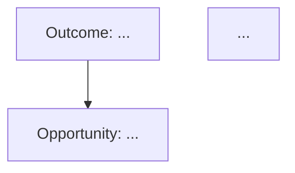

# PM OS Phase 0 Validation Checklist

**Purpose**: Verify all Phase 0 bootstrap components are functional
**Estimated Time**: 65 minutes (all 5 tests)
**Status**: Ready to execute

---

## Pre-Validation Setup

### ✅ Completed (No Action Needed)
- [x] Directory structure created
- [x] Identity Layer files present (STRATEGY.md, STANDARDS.md, ROADMAP.md)
- [x] Orchestrator agent implemented
- [x] Product Architect agent implemented
- [x] Templates created (agent spec, PRD, MCP integration)
- [x] Git configuration (.gitignore, .env.example)
- [x] Documentation suite complete

### Verification Commands
Run these to confirm setup is complete:

```bash
# Verify directory structure
ls -la .cursor/rules/
ls -la .claude/agents/
ls -la identity/
ls -la templates/
ls -la execution/

# Verify key files exist
cat identity/STRATEGY.md | head -20
cat .cursor/rules/_orchestrator.mdc | head -20
cat .cursor/rules/product_arch.mdc | head -20
```

Expected: All files present, no errors

---

## Test 1: OST Generation ⏱️ 10 minutes

### Objective
Validate Product Architect can generate Opportunity Solution Trees in Mermaid format

### Test Command

**In Cursor**:
```
@product_arch Generate an OST for improving PM OS discovery workflows
```

**In Claude Code**:
```
Product Architect: Generate an OST for improving PM OS discovery workflows
```

### Expected Output

**File Created**: `execution/discovery/YYYY-MM-DD_OST_PM-OS-Discovery-Workflows.md`

**Structure**:
```markdown
# Opportunity Solution Tree: [Title]

**Created**: YYYY-MM-DD
**Status**: Active
**Related PRD**: [Link if exists]

## Context
[1-2 paragraphs explaining strategic objective]

## OST Diagram


## Opportunity Details
[Detailed breakdown with evidence]

## Solution Evaluation
[Recommended solutions with rationale]

## Next Steps
- [ ] Action items
```

### Validation Criteria

- [ ] **File exists** at `execution/discovery/YYYY-MM-DD_OST_*.md`
- [ ] **Mermaid diagram present** and syntactically valid (renders in Markdown preview)
- [ ] **Outcome aligns** with at least one North Star Metric from `identity/STRATEGY.md` (any metric from Time Efficiency, Quality/Rework, Discovery/Validation, or Strategic Alignment categories)
- [ ] **Opportunities are user-centric** (describe pain points, not solutions)
- [ ] **Each opportunity has 2-3 solutions** listed
- [ ] **Evidence cited** for each opportunity (data, research, or reasoning)
- [ ] **Strategic alignment** mentioned (references vision or North Star)

### Success Criteria
✅ **PASS** if all 7 validation criteria met
❌ **FAIL** if Mermaid invalid, no evidence, or <2 solutions per opportunity

### If Test Fails
1. Check Product Architect agent file exists: `.cursor/rules/product_arch.mdc`
2. Verify Identity Layer loaded: Look for references to `identity/STRATEGY.md`
3. Review agent logic in `.cursor/rules/product_arch.mdc:1-100` (OST generation section)
4. Re-run with more specific prompt: "Generate a detailed OST for [topic] using Mermaid diagram format"

---

## Test 2: PRD Generation ⏱️ 20 minutes

### Objective
Validate Product Architect can generate BMAD-compliant PRDs

### Test Command

**In Cursor**:
```
@product_arch Create a PRD for adding a simple search filter to the PM OS artifact browser
```

**In Claude Code**:
```
Product Architect: Create a PRD for adding a simple search filter to the PM OS artifact browser
```

### Expected Output

**File Created**: `execution/prds/YYYY-MM-DD_PRD_Artifact-Search-Filter_v0.1.md`

**Structure**: Follow `templates/prd_template.md` exactly with these critical sections:
- Executive Summary with TL;DR
- **B** - Business Case (problem statement, strategic alignment, opportunity size)
- **M** - Metrics (primary, secondary, guardrail metrics with baselines and targets)
- **A** - Approach (solution overview, alternatives considered, phased rollout)
- **D** - Details (user stories, functional specs, UI specs, API specs, security)

### Validation Criteria

- [ ] **File exists** at `execution/prds/YYYY-MM-DD_PRD_*_v0.1.md`
- [ ] **BMAD structure complete**: All 4 sections present (Business, Metrics, Approach, Details)
- [ ] **Metrics include baselines**: Each metric has current state and target
- [ ] **User stories in Gherkin format**: Uses Given/When/Then structure
- [ ] **Security section present**: Includes authentication, authorization, data handling
- [ ] **Technical stack matches standards**: Uses React, TypeScript, Node.js, Tailwind from `identity/STANDARDS.md`
- [ ] **Professional writing**: Active voice, concise, technical (per `identity/STANDARDS.md`)
- [ ] **Evidence cited**: References data, user research, or clear reasoning for key decisions
- [ ] **Strategic alignment**: Explicitly states how feature advances at least one North Star Metric (see identity/STRATEGY.md for metric options - teams choose which metrics to track)

### Success Criteria
✅ **PASS** if 8/9 validation criteria met (can skip 1 minor criterion)
❌ **FAIL** if BMAD structure incomplete, no metrics baselines, or no Gherkin scenarios

### If Test Fails
1. Check `templates/prd_template.md` is being used: Look for template structure in output
2. Verify `identity/STANDARDS.md` loaded: Check for approved tech stack mentioned
3. Review Product Architect PRD generation logic in `.cursor/rules/product_arch.mdc:250-400`
4. Re-run with explicit template reference: "Create a PRD using templates/prd_template.md for [feature]"

---

## Test 3: Agent Spec Creation ⏱️ 15 minutes

### Objective
Validate Product Architect can create new agent specifications (self-building capability)

### Test Command

**In Cursor**:
```
@product_arch Create a new agent for reviewing API documentation quality
```

**In Claude Code**:
```
Product Architect: Create a new agent for reviewing API documentation quality
```

### Expected Output

**Files Created**:
1. `.cursor/rules/api_doc_reviewer.mdc` (Cursor version)
2. `.claude/agents/api_doc_reviewer.md` (Claude Code version)

**Structure**: Follow `templates/agent_spec_template.md` with these sections:
- Overview (purpose, status, created date)
- Core Capabilities (3-5 functions with inputs/outputs/examples)
- Triggers & Routing (file patterns, keywords)
- Context Requirements (identity files, external data)
- Non-Negotiables (quality standards, security)
- Output Formats (what artifacts agent produces)
- Workflow Integration (sequences, dependencies)
- Examples & Test Cases (at least 2)

### Validation Criteria

- [ ] **Both files exist**: `.cursor/rules/api_doc_reviewer.mdc` AND `.claude/agents/api_doc_reviewer.md`
- [ ] **All template sections present**: No "[TODO]" placeholders remaining
- [ ] **Capabilities section complete**: 3-5 capabilities with examples
- [ ] **Routing triggers defined**: File patterns (glob) and/or keywords
- [ ] **Non-negotiables specified**: Quality criteria and security requirements
- [ ] **Examples include I/O**: Show expected input and output for each test case
- [ ] **References identity/STANDARDS.md**: Enforces approved standards
- [ ] **Orchestrator routing proposed**: Notes how Orchestrator should route to this agent

### Success Criteria
✅ **PASS** if all 8 validation criteria met
❌ **FAIL** if template sections missing, no routing triggers, or no examples

### If Test Fails
1. Check `templates/agent_spec_template.md` exists and is complete
2. Verify both Cursor and Claude Code versions created (not just one)
3. Review Product Architect agent spec generation logic in `.cursor/rules/product_arch.mdc:400-550`
4. Re-run with template reference: "Create agent spec using templates/agent_spec_template.md for [domain]"

---

## Test 4: Identity Layer Auto-Loading ⏱️ 5 minutes

### Objective
Verify agents automatically load and reference Identity Layer context

### Test Method

**Review outputs from Tests 1-3** for explicit references to Identity Layer:

### Validation Criteria

From **Test 1 (OST)**:
- [ ] References North Star Metrics (e.g., "50% reduction in PRD time" or "4x discovery artifacts")
- [ ] Mentions strategic vision (e.g., "augment PMs into AI-powered product leaders")

From **Test 2 (PRD)**:
- [ ] Business Case section cites `identity/STRATEGY.md` alignment
- [ ] Technical stack matches `identity/STANDARDS.md` (React, TypeScript, Node.js, Tailwind)
- [ ] Writing follows brand voice from `identity/STANDARDS.md` (professional, technical, concise)

From **Test 3 (Agent Spec)**:
- [ ] Non-negotiables reference `identity/STANDARDS.md`
- [ ] Context Requirements section includes relevant identity files

### Success Criteria
✅ **PASS** if at least 4/6 criteria met (shows identity context loading)
❌ **FAIL** if no identity references found in any output

### If Test Fails
1. **Cursor**: Check Orchestrator has `alwaysApply: true` in `.cursor/rules/_orchestrator.mdc:1`
2. **Claude Code**: Verify `.claude/CLAUDE.md` exists and is comprehensive
3. Manually test: Ask "What is our North Star Metric?" and verify response cites `identity/STRATEGY.md`
4. Review Orchestrator context injection logic in `.cursor/rules/_orchestrator.mdc:50-150`

---

## Test 5: Self-Articulation (Phase 1 Planning) ⏱️ 15 minutes

### Objective
Validate PM OS can articulate its own next phase using roadmap context

### Test Command

**In Cursor**:
```
@product_arch Articulate the detailed Phase 1 implementation plan for PM OS
```

**In Claude Code**:
```
Product Architect: Articulate the detailed Phase 1 implementation plan for PM OS, including Engineering Partner agent, UX Strategist agent, and Google Drive MCP integration
```

### Expected Output

**Content**: Detailed plan covering Phase 1 scope from `identity/ROADMAP.md`

**Should Include**:
1. Engineering Partner agent
   - Capabilities: Technical feasibility, legacy code analysis, BPMN modeling, API specs, security review
   - Generated BY: Product Architect using agent spec template
   - Status: ✅ Complete (deployed 2026-01-31)
2. UX Strategist agent
   - Capabilities: Information architecture, React prototypes, accessibility
   - Generated BY: Product Architect with Engineering Partner review
   - Status: ✅ Complete (deployed 2026-01-31)
3. Google Drive MCP integration
   - Setup guide using `templates/mcp_integration_plan.md`
   - OAuth 2.0 configuration
   - First test: Retrieve historical PRD
   - Status: ✅ Complete (OAuth configured, 514ms latency)
4. End-to-end workflow test
   - Discovery (Product Architect) → Feasibility (Engineering Partner) → Security (Engineering Partner) → Prototype (UX Strategist)
   - Status: ✅ Complete (validated 2026-02-01)

### Validation Criteria

- [ ] **References identity/ROADMAP.md**: Explicitly cites roadmap for Phase 1 scope
- [ ] **Engineering Partner mentioned**: Includes capabilities and timeline
- [ ] **UX Strategist mentioned**: Includes capabilities and timeline
- [ ] **Google Drive MCP mentioned**: Includes setup approach
- [ ] **Uses self-building language**: Notes Product Architect will generate new agents
- [ ] **Cites templates**: References `templates/agent_spec_template.md` and `templates/mcp_integration_plan.md`
- [ ] **Success criteria defined**: States what "Phase 1 complete" means

### Success Criteria
✅ **PASS** if 6/7 validation criteria met
❌ **FAIL** if doesn't reference roadmap or missing key Phase 1 components

### If Test Fails
1. Check `identity/ROADMAP.md` exists and Phase 1 section is complete
2. Verify Product Architect has roadmap awareness in `.cursor/rules/product_arch.mdc` or `.claude/agents/product_arch.md`
3. Re-run with explicit roadmap reference: "Using identity/ROADMAP.md, articulate the Phase 1 plan"
4. Review Orchestrator context loading for `identity/ROADMAP.md` in `.cursor/rules/_orchestrator.mdc:80-100`

---

## Post-Test Actions

### If All Tests Pass ✅

**Phase 0 Status**: 100% Complete

**Next Steps**:
1. ✅ Update `pm-os-reference/documentation/IMPLEMENTATION_STATUS.md` with completion status
2. ✅ Save validation results to `pm-os-reference/documentation/validation-reports/`
3. ✅ Phase 1 completed:
   - ✅ Engineering Partner agent spec created and implemented
   - ✅ UX Strategist agent spec created and implemented
   - ✅ Google Drive MCP setup guide created using `templates/mcp_integration_plan.md`
   - ✅ OAuth 2.0 configured and tested (514ms latency)
4. ✅ Phase 2 completed:
   - ✅ Data Analyst agent created and operational
   - ✅ GTM Strategist agent created and operational
5. ⏳ Phase 3 in progress (85% complete):
   - ✅ System Evaluator agent operational
   - ✅ Documentation Maintainer agent operational
   - ⏳ Quality metrics dashboard (85% - in progress)
6. 🟡 Phase 4 next: MCP Integration Suite (Jira, Confluence, Slack, Snowflake)

### If Any Test Fails ❌

**Phase 0 Status**: Incomplete - Troubleshooting Required

**Troubleshooting Process**:
1. **Identify which test failed** and review "If Test Fails" section
2. **Check agent files exist** and are not corrupted
3. **Verify Identity Layer** files are complete (STRATEGY.md, STANDARDS.md, ROADMAP.md)
4. **Review agent logic** in relevant `.mdc` or `.md` file
5. **Re-run test** with more explicit prompts (cite templates/identity files directly)
6. **Document issue** in `pm-os-reference/documentation/IMPLEMENTATION_STATUS.md` under "Active Risks"

**If multiple tests fail**:
- Review Orchestrator routing logic (may be routing to wrong agent)
- Check for file corruption (re-read template files)
- Verify environment (Cursor vs Claude Code specific issues)

### Partial Success Scenarios

**If Tests 1-2 pass, but Test 3 fails** (agent spec creation):
- ✅ PM OS can generate artifacts (OSTs, PRDs)
- ❌ Self-building capability not working
- **Impact**: Can use PM OS for discovery/PRDs, but can't expand capabilities
- **Mitigation**: Manually create Phase 1 agents using `templates/agent_spec_template.md`

**If Tests 1-3 pass, but Test 4 fails** (identity loading):
- ✅ PM OS generates outputs, but they may lack strategic alignment
- **Impact**: Outputs may not reference North Star Metrics or brand voice
- **Mitigation**: Manually review outputs for alignment, edit as needed

**If Tests 1-4 pass, but Test 5 fails** (self-articulation):
- ✅ PM OS fully functional for current phase
- ❌ Can't autonomously plan next phase
- **Impact**: Requires human PM to plan Phase 1 (not self-articulating)
- **Mitigation**: Use `identity/ROADMAP.md` directly for Phase 1 planning

---

## Success Metrics Summary

### Validation Test Results

| Test | Objective | Time | Status | Pass Criteria |
|------|-----------|------|--------|---------------|
| 1 | OST Generation | 10 min | ⏳ Pending | 7/7 criteria |
| 2 | PRD Generation | 20 min | ⏳ Pending | 8/9 criteria |
| 3 | Agent Spec Creation | 15 min | ⏳ Pending | 8/8 criteria |
| 4 | Identity Layer Loading | 5 min | ⏳ Pending | 4/6 criteria |
| 5 | Self-Articulation | 15 min | ⏳ Pending | 6/7 criteria |

**Total Validation Time**: 65 minutes

### Overall Phase 0 Status

**Before Validation**: 70% complete (infrastructure ready, testing pending)
**After Validation** (if all pass): 100% complete (ready for Phase 1)

---

## Recording Results

### Test Results Template

Save validation results to `pm-os-reference/documentation/validation-reports/YYYY-MM-DD_Validation_Results.md` using this template:

```markdown
## Validation Test Results (Executed: YYYY-MM-DD)

### Test 1: OST Generation
- **Status**: [PASS / FAIL]
- **File Created**: execution/discovery/[filename]
- **Criteria Met**: X/7
- **Notes**: [Any observations]

### Test 2: PRD Generation
- **Status**: [PASS / FAIL]
- **File Created**: execution/prds/[filename]
- **Criteria Met**: X/9
- **Notes**: [Any observations]

### Test 3: Agent Spec Creation
- **Status**: [PASS / FAIL]
- **Files Created**: .cursor/rules/[filename], .claude/agents/[filename]
- **Criteria Met**: X/8
- **Notes**: [Any observations]

### Test 4: Identity Layer Loading
- **Status**: [PASS / FAIL]
- **Criteria Met**: X/6
- **Notes**: [Any observations]

### Test 5: Self-Articulation
- **Status**: [PASS / FAIL]
- **Criteria Met**: X/7
- **Notes**: [Any observations]

### Overall Result
- **Tests Passed**: X/5
- **Phase 0 Status**: [100% Complete / Incomplete - See troubleshooting]
- **Ready for Phase 1**: [YES / NO]
```

---

## Approval Gate

**Phase 0 is officially complete when**:
- ✅ All 5 validation tests pass
- ✅ At least one OST validated by human PM as high-quality
- ✅ At least one PRD validated by human PM as comprehensive
- ✅ Test results documented in `PHASE_0_STATUS.md`

**Approval Required From**: Human PM (Product Owner for PM OS)

**Sign-Off**:
```
[ ] I have reviewed all validation test results
[ ] I have validated at least one OST for quality
[ ] I have validated at least one PRD for completeness
[ ] I approve Phase 0 as complete and ready for Phase 1

Approved By: ___________________
Date: ___________________
```

---

## Quick Reference: Running All Tests

### Sequential Execution (Recommended)

**Total Time**: 65 minutes

```bash
# Test 1 (10 min)
# Command: Product Architect: Generate an OST for improving PM OS discovery workflows
# Check: execution/discovery/YYYY-MM-DD_OST_*.md

# Test 2 (20 min)
# Command: Product Architect: Create a PRD for adding a simple search filter to PM OS
# Check: execution/prds/YYYY-MM-DD_PRD_*_v0.1.md

# Test 3 (15 min)
# Command: Product Architect: Create a new agent for reviewing API documentation quality
# Check: .cursor/rules/api_doc_reviewer.mdc + .claude/agents/api_doc_reviewer.md

# Test 4 (5 min)
# Review Tests 1-3 outputs for identity/STRATEGY.md references

# Test 5 (15 min)
# Command: Product Architect: Articulate the detailed Phase 1 implementation plan
# Check: Response includes Engineering Partner, UX Strategist, Google Drive MCP
```

### Parallel Execution (Claude Code Only)

If using Claude Code with parallel processing capability:

```
Spawn 3 tasks in parallel:
1. Generate OST for PM OS discovery
2. Generate PRD for artifact search filter
3. Generate agent spec for API doc reviewer

Then sequentially:
4. Review outputs for identity references (Test 4)
5. Generate Phase 1 plan (Test 5)
```

**Total Time**: ~35 minutes (leverages parallelization)

---

**Validation Checklist Status**: Ready for Execution
**Expected Completion**: Within 65 minutes
**Blocker**: None (all prerequisites met)
**Next Action**: Run Test 1 (OST Generation)

---

**Document Owner**: PM OS Validation Team
**Last Updated**: 2026-01-31
**Usage**: Execute tests sequentially, record results, submit for approval
