# Opportunity Solution Tree: Improving PM OS Discovery Workflows

**Created**: 2026-01-31
**Status**: Active
**Related PRD**: TBD (will be generated post-validation)
**Generated By**: Product Architect Agent (Test 1 - Phase 0 Validation)

---

## Context

**Strategic Objective**: Increase discovery artifacts output from 2 to 8 per week (4x increase - North Star Metric from identity/STRATEGY.md:14)

**Why This Matters**:
PM OS is in Phase 0 (Bootstrap Foundation), and discovery workflows are the entry point for all product development. The Product Architect agent can generate Opportunity Solution Trees and PRDs, but current workflows may have friction points preventing PMs from achieving the North Star target of 8 discovery artifacts per week.

**Current State**:
- Product Architect agent operational (identity/ROADMAP.md indicates Phase 0 ~70% complete)
- Templates available (OST format, PRD structure in templates/)
- No MCP integrations yet active (Google Drive, Jira, etc. coming in Phase 1+)
- No existing discovery artifacts to reference (execution/discovery/ is empty)
- Single agent operational (Engineering Partner, UX Strategist coming in Phase 1)

**Evidence Source**:
- identity/STRATEGY.md:14 (North Star: 4x discovery artifacts)
- identity/ROADMAP.md (Phase 0 status, Phase 1 plans)
- Current system state (verified via directory inspection)

---

## OST Diagram

```mermaid
graph TD
    A[Outcome: Increase Discovery Artifacts from 2 to 8 per week]

    A --> B[Opportunity 1: PMs uncertain when to invoke Product Architect]
    A --> C[Opportunity 2: Insufficient examples for first-time users]
    A --> D[Opportunity 3: No historical context available in Phase 0]
    A --> E[Opportunity 4: Discovery workflow boundaries unclear]

    B --> F[Solution 1A: Add quick reference card in QUICK_START.md]
    B --> G[Solution 1B: Orchestrator provides usage hints]
    B --> H[Solution 1C: Interactive tutorial on first launch]

    C --> I[Solution 2A: Generate 5 sample OSTs for common scenarios]
    C --> J[Solution 2B: Add inline examples to templates]
    C --> K[Solution 2C: Video walkthrough of OST generation]

    D --> L[Solution 3A: Create curated starter prompts list]
    D --> M[Solution 3B: Fast-track Google Drive MCP to Phase 0]
    D --> N[Solution 3C: Seed execution/discovery/ with templates]

    E --> O[Solution 4A: Document discovery-to-PRD workflow]
    E --> P[Solution 4B: Add decision tree for workflow selection]
    E --> Q[Solution 4C: Agent suggests next steps after OST]
```



---

## Opportunity Details

### Opportunity 1: PMs Uncertain When to Invoke Product Architect

**Description**:
Product managers may be unsure when discovery tasks require the Product Architect agent versus handling manually. This ambiguity leads to underutilization or incorrect invocation patterns.

**Evidence**:
- QUICK_START.md:50 lists commands but doesn't specify decision criteria for when to use each
- No usage analytics yet (Phase 0), but common pattern in AI tool adoption
- Orchestrator routing logic exists (.cursor/rules/_orchestrator.mdc:35-70) but users don't see it

**User Pain Point**:
"I have a feature idea - should I start with an OST, jump straight to a PRD, or do manual research first?"

**Impact if Unsolved**:
- Discovery artifacts created inconsistently (some skip OST step)
- PMs revert to manual processes due to uncertainty
- North Star target (8 artifacts/week) unachievable due to adoption friction

**Current Workaround**:
PMs must read full README.md (4,400 lines) to understand workflow patterns - high cognitive load.

---

### Opportunity 2: Insufficient Examples for First-Time Users

**Description**:
The execution/discovery/ directory is empty (verified 2026-01-31). New PMs lack reference examples showing what high-quality OSTs look like, leading to hesitation and lower output velocity.

**Evidence**:
- `ls execution/discovery/` returned empty directory
- Templates provide structure (templates/ost_example referenced in orchestrator) but no filled examples
- QUICK_START.md:52 shows command syntax but not expected output quality

**User Pain Point**:
"I generated my first OST, but I'm not sure if it's good enough or follows the right format."

**Impact if Unsolved**:
- PMs spend extra time second-guessing output quality
- Iteration cycles increase (generate → validate → regenerate)
- Confidence in PM OS outputs remains low during onboarding

**Current Workaround**:
PMs must refer to templates/ directory and mentally map abstract structure to concrete examples.

---

### Opportunity 3: No Historical Context Available in Phase 0

**Description**:
MCP integrations (Google Drive, Jira, Notion) are configured but disabled (mcp/config.json:8-11). Product Architect cannot retrieve historical PRDs, user research, or strategy docs to inform discovery.

**Evidence**:
- mcp/config.json shows all integrations have `"disabled": true`
- identity/ROADMAP.md:85 indicates Google Drive MCP planned for Phase 1 Week 5
- Product Architect agent spec (.cursor/rules/product_arch.mdc:450) mentions Google Drive capability but not yet active

**User Pain Point**:
"I'm working on a feature similar to something we built last year, but PM OS can't access those old docs for context."

**Impact if Unsolved**:
- Discovery artifacts lack organizational memory (reinventing wheels)
- Quality lower than human PM drafts that reference past work
- PMs must manually paste historical context into prompts

**Current Workaround**:
PMs manually copy/paste content from Google Drive, Jira, Notion into Product Architect prompts - time-consuming.

---

### Opportunity 4: Discovery Workflow Boundaries Unclear

**Description**:
PM OS supports multiple discovery workflows (OST-only, OST→PRD, OST→PRD→Tech Spec), but documentation doesn't clearly state when to use each path or how to transition between steps.

**Evidence**:
- README.md:355-385 shows "Workflow 1: Discovery → PRD (Solo)" but lacks decision criteria
- identity/ROADMAP.md:92 mentions end-to-end workflow but only available Phase 1+
- No flowchart showing "if X, use Workflow A; if Y, use Workflow B"

**User Pain Point**:
"I generated an OST - now what? Do I always need a PRD next, or can I stop at the OST?"

**Impact if Unsolved**:
- PMs create unnecessary artifacts (e.g., full PRD for exploratory research)
- Cognitive overhead deciding next steps slows velocity
- Inconsistent artifact chains (some OSTs never convert to PRDs, unclear why)

**Current Workaround**:
PMs rely on tribal knowledge or ask senior PMs for workflow guidance.

---

## Solution Evaluation

### Recommended Solutions (High Impact, High Feasibility)

#### 1. Solution 2A: Generate 5 Sample OSTs for Common Scenarios
**For Opportunity 2: Insufficient Examples**

**Rationale**:
- Provides immediate concrete examples for reference
- Low effort (Product Architect can generate in <1 hour)
- High impact (reduces first-time user hesitation)

**Implementation**:
1. Use Product Architect to generate sample OSTs for:
   - User onboarding improvement (common PM scenario)
   - Performance optimization (technical feature)
   - New pricing model exploration (strategic initiative)
   - Mobile app feature parity (platform expansion)
   - Developer experience improvement (internal tooling)
2. Save all to execution/discovery/ as reference examples
3. Add index file: execution/discovery/SAMPLE_OSTs_INDEX.md linking to each
4. Update QUICK_START.md:55 to reference sample OSTs

**Expected Impact**:
- Reduce first OST generation time by 40% (from 20min to 12min)
- Increase PM confidence in output quality
- Accelerate onboarding from 2 hours to 90 minutes

**Feasibility**: High (can implement immediately in Phase 0)

---

#### 2. Solution 1A: Add Quick Reference Card in QUICK_START.md
**For Opportunity 1: PMs Uncertain When to Invoke Product Architect**

**Rationale**:
- Addresses decision-making friction at entry point
- Minimal effort (documentation update)
- Aligns with identity/STANDARDS.md:12 (clear headings, actionable)

**Implementation**:
1. Add "When to Use Product Architect" decision tree to QUICK_START.md:
   ```
   Use Product Architect when:
   - ✅ Exploring problem space (generate OST)
   - ✅ Drafting feature spec (generate PRD)
   - ✅ Creating new PM OS agent (self-building)

   Don't use Product Architect for:
   - ❌ Quick questions (use Read tool for identity/)
   - ❌ Data queries (wait for Data Analyst in Phase 2)
   - ❌ Technical implementation (Engineering Partner in Phase 1)
   ```
2. Add usage examples with concrete prompts
3. Link from README.md:305 for discoverability

**Expected Impact**:
- Reduce incorrect agent invocations by 60%
- Increase Product Architect usage by 30% (overcome hesitation)
- Improve Orchestrator routing efficiency

**Feasibility**: High (documentation-only change)

---

#### 3. Solution 4A: Document Discovery-to-PRD Workflow
**For Opportunity 4: Discovery Workflow Boundaries Unclear**

**Rationale**:
- Provides clear workflow guidance reducing decision paralysis
- Supports identity/STRATEGY.md:42 (product decisions traceable)
- Medium effort, high clarity gain

**Implementation**:
1. Create docs/DISCOVERY_WORKFLOWS.md with decision flowchart:
   ```
   START: Have feature idea
   ↓
   Generate OST (always - maps problem space)
   ↓
   Decision Point 1: Is this exploratory research only?
   - YES → Stop at OST, iterate on hypotheses
   - NO → Continue to PRD
   ↓
   Decision Point 2: Is this customer-facing or high complexity?
   - YES → Wait for Phase 1 (Engineering Partner + UX Strategist review)
   - NO → Generate PRD v0.1 solo, human review
   ```
2. Add "Next Steps" recommendations to Product Architect OST outputs
3. Update QUICK_START.md:142 to reference workflow guide

**Expected Impact**:
- Reduce "what next?" questions by 50%
- Increase OST-to-PRD conversion rate (currently unknown, estimated 30% → 70%)
- Clearer artifact lineage (OST → PRD → Tech Spec)

**Feasibility**: Medium (requires documentation + agent logic update)

---

### Deferred Solutions (Lower Priority or Phase 1+ Dependent)

#### Solution 3B: Fast-Track Google Drive MCP to Phase 0
**For Opportunity 3: No Historical Context**

**Why Deferred**:
- Requires OAuth 2.0 setup, credential management (identity/STANDARDS.md:38-42)
- Phase 1 scoped for Week 5 (identity/ROADMAP.md:85)
- Phase 0 focused on core bootstrap validation, not integrations

**Revisit When**: Phase 0 complete, beginning Phase 1 Week 3

---

#### Solution 1C: Interactive Tutorial on First Launch
**For Opportunity 1: PM Uncertain When to Invoke**

**Why Deferred**:
- Requires IDE integration work (Cursor/Claude Code specific)
- Higher implementation effort vs. documentation solutions
- Unclear feasibility without Phase 5 IDE optimization work

**Revisit When**: Phase 5 (Hybrid IDE Optimization, Weeks 15-17)

---

#### Solution 2C: Video Walkthrough of OST Generation
**For Opportunity 2: Insufficient Examples**

**Why Deferred**:
- Requires video production (outside core PM OS scope)
- Sample OSTs (Solution 2A) provide 80% of value with 20% effort
- Video becomes outdated as PM OS evolves

**Revisit When**: Phase 6 (Enterprise Readiness) if team onboarding at scale

---

## Next Steps

### Immediate Actions (Phase 0 Validation)
- [ ] **Validate this OST meets Test 1 criteria** (VALIDATION_CHECKLIST.md:50-85)
- [ ] **Human PM review** for quality and strategic alignment
- [ ] **Generate PRD** for top 3 recommended solutions (Solutions 2A, 1A, 4A)

### Short-Term (Phase 0 Completion)
- [ ] **Implement Solution 2A**: Generate 5 sample OSTs using Product Architect
- [ ] **Implement Solution 1A**: Add quick reference card to QUICK_START.md
- [ ] **Implement Solution 4A**: Create DISCOVERY_WORKFLOWS.md guide

### Medium-Term (Phase 1)
- [ ] **Revisit Solution 3B**: Enable Google Drive MCP for historical context
- [ ] **Measure impact**: Track discovery artifacts per week (baseline vs. post-improvements)
- [ ] **Iterate**: Run System Evaluator audit (Phase 3) on discovery workflow effectiveness

---

## Success Metrics

**Baseline** (Phase 0 Pre-Improvements):
- Discovery artifacts per week: 2 (identity/STRATEGY.md:14)
- First OST generation time: ~20 minutes (estimated)
- PM onboarding time: 2 hours (QUICK_START.md target)

**Target** (Phase 0 Post-Improvements):
- Discovery artifacts per week: 4 (50% of North Star, achievable in Phase 0)
- First OST generation time: 12 minutes (40% reduction via samples)
- PM onboarding time: 90 minutes (25% reduction via quick reference)

**North Star** (Phase 3+):
- Discovery artifacts per week: 8 (4x baseline - achieved with full agent team + MCP integrations)

**Measurement Method**:
- Track files created in execution/discovery/ per week
- User surveys: "Time to generate first OST" and "Confidence in OST quality"
- Git commit frequency in execution/ directories

---

## Alignment with PM OS Strategy

**Vision Alignment** (identity/STRATEGY.md:4):
"Augment Product Managers into AI-powered product leaders who deliver higher-quality outcomes in a fraction of the time."

✅ This OST directly supports PM augmentation by removing friction in discovery workflows, enabling faster artifact generation.

**North Star Metric Alignment** (identity/STRATEGY.md:14):
"4x increase in discovery artifacts (from 2 to 8 per week)"

✅ All opportunities and solutions target this metric. Recommended solutions aim for 50% progress in Phase 0 (2→4 artifacts/week).

**Strategic Principle Alignment** (identity/STRATEGY.md:32):
"Progressive Disclosure: Start minimal (Phase 0 bootstrap) → self-building (Phases 1-2) → self-improving (Phase 3)"

✅ Recommended solutions focus on Phase 0-achievable improvements (samples, documentation). Deferred solutions respect phase boundaries.

---

## References

**Identity Layer**:
- identity/STRATEGY.md:14 - North Star Metrics
- identity/STANDARDS.md:69 - OST format requirements (Mermaid diagrams)
- identity/ROADMAP.md - Phase 0 status, Phase 1 plans

**Current Implementation**:
- .cursor/rules/product_arch.mdc - Product Architect agent capabilities
- templates/agent_spec_template.md - Referenced for agent creation workflows
- execution/discovery/ - Target directory for discovery artifacts (currently empty)

**Documentation**:
- README.md:305-340 - Workflow patterns
- QUICK_START.md:50-95 - Common commands
- VALIDATION_CHECKLIST.md:50-85 - Test 1 criteria

---

**OST Status**: Active (awaiting validation)
**Next Action**: Human PM review against VALIDATION_CHECKLIST.md criteria
**Expected Follow-Up**: Generate PRD for implementing Solutions 2A, 1A, 4A
**Generated By**: Product Architect Agent (Claude Code)
**Validation Test**: Test 1 - Phase 0 Bootstrap
