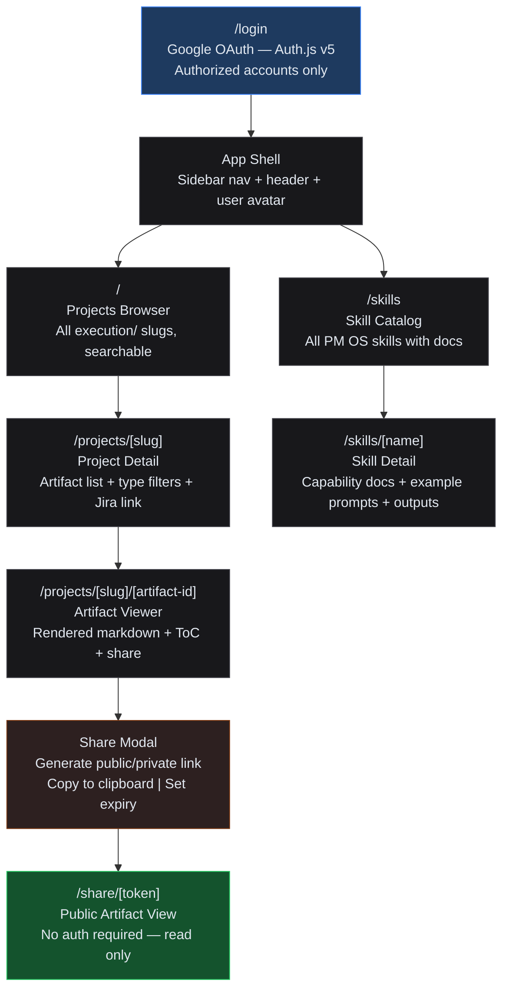
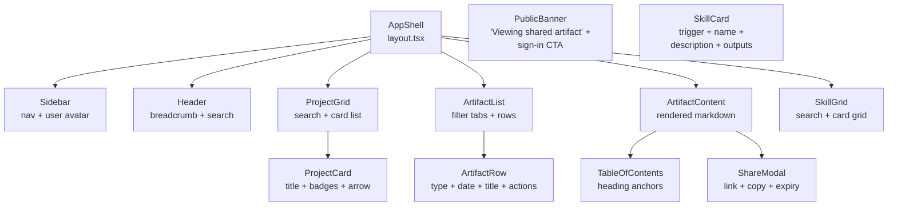
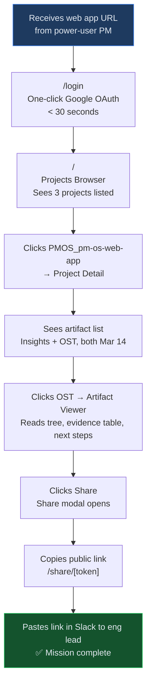
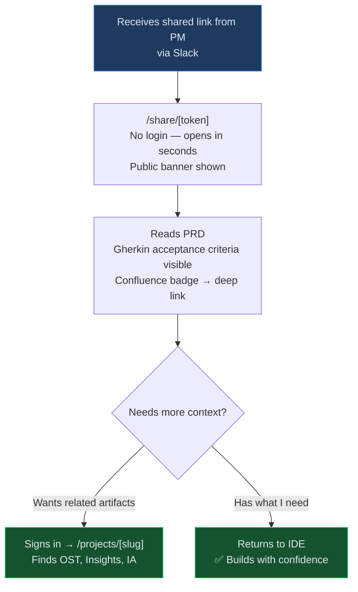
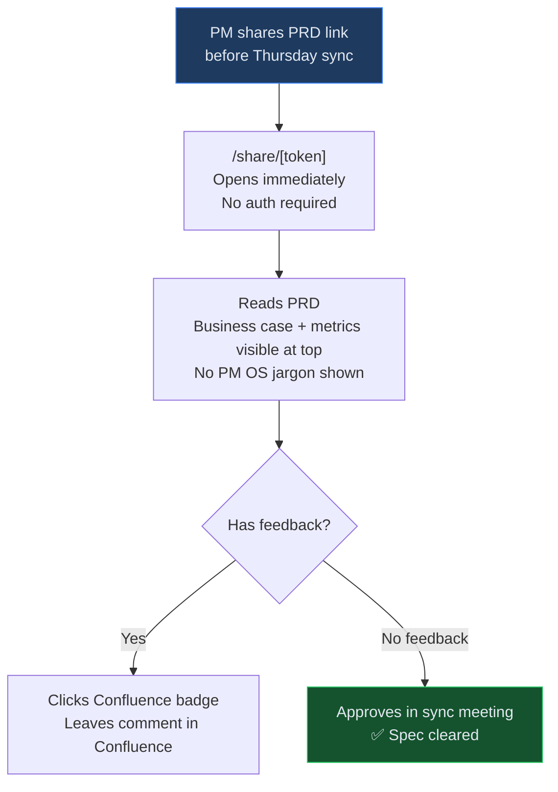

# Information Architecture: PM OS Companion Web Application

**Date**: 2026-03-14
**Project**: PMOS_pm-os-web-app
**Artifact Type**: Information Architecture
**Status**: Draft — Awaiting PM Review
**Phase Scope**: Phase 1 — Read Layer (artifact browsing + sharing only)
**Prototype**: `2026-03-14_Prototype_PM-OS-Web-App.html`

---

## Navigation Hierarchy



---

## Route Structure

| Route | Page Component | Auth | Description |
|-------|---------------|------|-------------|
| `/login` | `LoginPage` | Public | Google OAuth via Auth.js v5 |
| `/` | `ProjectsBrowser` | Required | Grid of all execution/ projects with metadata |
| `/projects/[slug]` | `ProjectDetail` | Required | Artifact list for one slug; filter by type; Jira + Confluence links |
| `/projects/[slug]/[artifact-id]` | `ArtifactViewer` | Required | Rendered markdown; ToC sidebar; share button |
| `/skills` | `SkillCatalog` | Required | Searchable grid of all PM OS skills |
| `/skills/[name]` | `SkillDetail` | Required | Capability docs, example prompts, output types |
| `/share/[token]` | `PublicArtifactView` | **None** | Unauthenticated read-only artifact view |

**Next.js App Router groupings**:
```
app/
├── (auth)/
│   └── login/page.tsx
├── (app)/                          ← auth-protected layout
│   ├── layout.tsx                  ← sidebar + header
│   ├── page.tsx                    ← projects browser
│   ├── projects/
│   │   └── [slug]/
│   │       ├── page.tsx            ← project detail
│   │       └── [artifact]/
│   │           └── page.tsx        ← artifact viewer
│   └── skills/
│       ├── page.tsx                ← skill catalog
│       └── [name]/
│           └── page.tsx            ← skill detail
└── share/
    └── [token]/
        └── page.tsx                ← public view (no layout)
```

---

## Content Taxonomy

### Project

Maps to one `execution/[slug]/` directory.

| Field | Source | Display |
|-------|--------|---------|
| `jiraKey` | Slug prefix (e.g., `PMOS`) | Monospace badge |
| `slug` | Directory name | URL segment |
| `title` | Derived from slug suffix (kebab → title case) | H1 |
| `artifactCount` | File count in directory | "N artifacts" |
| `lastUpdated` | Latest file mtime | "Mar 14, 2026" |
| `artifactTypes` | Set of types parsed from filenames | Badge row |
| `jiraUrl` | Constructed from jiraKey + Jira base URL | External link |
| `phase` | Inferred from artifact types present | Status badge |

**Phase inference logic**:
- Has `Sprint-Log` → "Sprint N"
- Has `PRD`, no Sprint Log → "Planning"
- Has `Insights` or `OST`, no PRD → "Discovery"
- Has `Launch` → "Ready for Dev"

---

### Artifact

Maps to one file in `execution/[slug]/`.

| Field | Source | Display |
|-------|--------|---------|
| `type` | Filename segment 2 (e.g., `Insights`, `OST`, `PRD`) | Color-coded badge |
| `date` | Filename prefix `YYYY-MM-DD` | Date display |
| `title` | Filename segment 3 onward, dashes → spaces | H1 in viewer |
| `content` | File contents (markdown) | Rendered HTML |
| `confluenceUrl` | Looked up via Rovo MCP at index time | "Confluence" badge |
| `jiraUrl` | From project's jiraKey | Header link |
| `shareToken` | Generated on demand (cuid2) | Not displayed by default |

**Artifact type → color mapping**:
| Type | Color |
|------|-------|
| Insights | Purple |
| OST | Blue |
| PRD | Emerald |
| IA | Orange |
| Prototype | Pink |
| Sprint-Log | Yellow |
| Launch | Cyan |
| GTM | Red |

---

### Skill

Maps to one `.claude/skills/[name]/SKILL.md` file.

| Field | Source | Display |
|-------|--------|---------|
| `name` | Directory name (title case) | Card title |
| `trigger` | e.g., `/discovery` | Monospace trigger badge |
| `description` | First paragraph of SKILL.md | Card subtitle |
| `outputTypes` | Artifact types this skill produces | Badge row |
| `confluenceIntegration` | Boolean from SKILL.md | "Publishes to Confluence" badge |
| `jiraIntegration` | Boolean | "Reads Jira" badge |

---

## Component Hierarchy



---

## User Journey Maps

### Journey 1: Non-CLI PM — First Visit

**Goal**: Read an OST and share it with the engineering lead.



**Key moments**:
- Login must be frictionless — Google OAuth, no manual setup
- Projects list must show recency — newest/active projects first
- Share modal must produce a link usable without PM OS login

---

### Journey 2: Engineer Finding a Spec

**Goal**: Read the PRD for a feature before implementation starts.



**Key moments**:
- Public share view must work without login — no friction
- Confluence badge on artifact gives engineers a familiar destination
- If they sign in, they land on the project (not just the one artifact)

---

### Journey 3: Exec Reviewing Status

**Goal**: Review a PRD before a stakeholder sync.



**Key moments**:
- Exec must see zero PM OS chrome — no sidebar, no file paths, no skill terminology
- Business case section should be first (BMAD structure already correct)
- Confluence link for comments keeps feedback in the right place

---

## Design Rationale

### Decision 1: Sidebar navigation (not top nav)

**Why**: Artifact content is the focus. Sidebar keeps primary nav persistent without competing with content.

**Evidence**: Engineers and execs who receive shared links land on `/share/[token]` — no sidebar at all. Sidebar only serves authenticated PMs and is secondary to the artifact content.

**Trade-off**: Top nav considered for simplicity. Rejected because projects + skills are two equally important sections; a sidebar makes hierarchy clearer and scales better when settings, onboarding, and team features are added in Phase 2.

---

### Decision 2: Public share view requires no authentication

**Why**: Engineers and execs will not create PM OS accounts just to read a PRD. Authentication friction = artifact not read.

**Evidence**: "Execs/stakeholders reviewing PRDs and status" — discovery context. Execs don't manage tools, they receive links.

**Trade-off**: Security risk of public links. Mitigated by: token-based URLs (unguessable), optional expiry, no write operations on public view, no PII in PM OS artifacts (STANDARDS.md requirement).

---

### Decision 3: Artifact type filter as horizontal tab bar (not sidebar filter)

**Why**: Most projects have ≤ 8 artifact types. A tab bar is scannable and keeps the artifact list as the visual focus.

**Evidence**: Current artifact types: Insights, OST, PRD, IA, Prototype, Sprint Log, Launch, GTM = 8 types max. A sidebar filter panel would be oversized for this cardinality.

**Trade-off**: If a project ever has 10+ artifact types, tabs will overflow. Mitigation: "More" dropdown if count > 6.

---

### Decision 4: Render markdown server-side (not client-side)

**Why**: Consistent rendering, fast initial paint, better for execs and stakeholders on slow connections. Server-side rendering also allows Confluence-style heading anchors for the ToC.

**Evidence**: Next.js 15 SSR is the standard platform (STANDARDS.md). Artifact content is static between CLI runs — no real-time rendering needed.

**Trade-off**: Client-side markdown with react-markdown would be simpler. Rejected: adds a client bundle, risks rendering differences between server and client, and loses the ability to inject Confluence/Jira deep links server-side.

---

### Decision 5: Skill catalog is read-only in Phase 1

**Why**: Phase 1 is the Read Layer. Running skills from the browser is Phase 2. Shipping skill catalog first validates whether non-CLI PMs actually use it for self-onboarding before investing in skill execution UX.

**Evidence**: OST Solution 3B (Quick Win) vs. Solutions 1A/1B (Strategic Bets). Validate demand before building execution.

**Trade-off**: Non-CLI PMs may be frustrated they can't run a skill after reading about it. Mitigated by: clear "Run this skill in Claude Code →" CTA with copy-able example prompt.

---

## Accessibility Notes

- All interactive elements keyboard-navigable (Tab order: sidebar nav → main content → filter tabs → artifact rows)
- Color not the sole indicator of artifact type — type name always shown alongside badge color
- Share modal trapped focus (focus-trap on open, returns to trigger button on close)
- Public share view: no auth-required chrome — clean reading experience
- Artifact content rendered with semantic `h2–h4`, `table`, `code`, `blockquote` elements from markdown
- Touch targets 44x44px minimum on mobile (share button, artifact row, project card)

---

## Phase 2 Additions (out of scope for Phase 1)

| Addition | Route | Unlocks |
|----------|-------|---------|
| Skill execution UI | `/skills/[name]/run` | Non-CLI PMs can run skills |
| identity/ editor | `/settings/identity` | Browser-based STRATEGY.md / STANDARDS.md editing |
| Onboarding flow | `/onboarding` | Guided setup: Jira connect → first project → first skill |
| Project status dashboard | `/` (enhanced) | Per-project phase + Jira sprint status |
| Confluence sync panel | `/projects/[slug]/sync` | Re-publish artifacts to Confluence |

---

*Generated by PM OS UX Strategist Skill | 2026-03-14*
*Next artifact: `2026-03-14_Prototype_PM-OS-Web-App.html` (interactive prototype)*
*After review: Run `/prd` for Phase 1 BMAD PRD*
