# OST: PM OS Companion Web Application

**Date**: 2026-03-14
**Project**: PMOS_pm-os-web-app
**Artifact Type**: Opportunity Solution Tree
**Status**: Draft — Awaiting PM Review
**North Star Alignment**: PM OS achieves 5+ concurrent PM users with onboarding < 2 hours

---

## Opportunity Solution Tree

```mermaid
graph TD
    ROOT["🎯 OUTCOME\nPM OS scales to 5+ concurrent users\nwith onboarding < 2 hours\n(Phase 8 North Star)"]

    %% Opportunity 1
    O1["🔍 OPPORTUNITY 1\nNon-CLI PMs cannot access PM OS\n→ Team adoption is blocked\nEvidence: 1 user today vs. 5+ target"]

    S1A["💡 SOLUTION 1A\nWeb skill interface\nRun discovery, PRD, launch\nvia browser form + progress view\n[Strategic Bet]"]

    S1B["💡 SOLUTION 1B\nGuided skill wizard\nStep-by-step inputs with\ncontext from identity/ files\n[Strategic Bet]"]

    S1C["💡 SOLUTION 1C\nSkill output viewer\nRead-only access to artifact\noutputs from executed skills\n[Quick Win — Phase 1]"]

    %% Opportunity 2
    O2["🔍 OPPORTUNITY 2\nArtifacts trapped in execution/ folders\n→ Stakeholders can't access PM OS outputs\nEvidence: No browsable artifact index exists"]

    S2A["💡 SOLUTION 2A\nProject browser\nBrowse execution/ by project slug,\nview artifact list + content\n[Quick Win — Phase 1]"]

    S2B["💡 SOLUTION 2B\nShareable artifact links\nGenerate public/private URLs\nfor specific artifacts\n[Quick Win — Phase 1]"]

    S2C["💡 SOLUTION 2C\nConfluence sync dashboard\nStatus of Confluence auto-publish\nper artifact + re-sync trigger\n[Medium — Phase 2]"]

    %% Opportunity 3
    O3["🔍 OPPORTUNITY 3\nOnboarding requires power-user\nhand-holding → doesn't scale\nEvidence: Phase 8 target implies current > 2hr"]

    S3A["💡 SOLUTION 3A\nSetup wizard\nidentity/ file editor in browser\nwith validation + guidance\n[Strategic Bet]"]

    S3B["💡 SOLUTION 3B\nSkill catalog + docs\nBrowsable skill reference,\nexamples, prompt templates\n[Quick Win — Phase 1]"]

    S3C["💡 SOLUTION 3C\nOnboarding checklist flow\nGuided steps: connect Jira,\ncreate first project, run first skill\n[Medium — Phase 2]"]

    %% Opportunity 4
    O4["🔍 OPPORTUNITY 4\nNo role-aware view for engineers,\ndesigners, execs\n→ Wrong people see wrong artifacts\nEvidence: Multiple personas named, zero personalization today"]

    S4A["💡 SOLUTION 4A\nRole selector on login\nEngineer | Designer | Exec | PM\n→ Different default views\n[ASSUMPTION — validate first]"]

    S4B["💡 SOLUTION 4B\nArtifact type filters\nFilter by PRD / OST / Prototype / Sprint Log\nNo roles required — just filters\n[Quick Win — Phase 1]"]

    %% Opportunity 5
    O5["🔍 OPPORTUNITY 5\nPM OS ROI invisible to stakeholders\n→ Hard to justify investment + expansion\nEvidence: NSMs exist but untracked"]

    S5A["💡 SOLUTION 5A\nVelocity dashboard\nTime-to-spec, artifact count,\ncycle time from Jira data\n[ASSUMPTION — validate first]"]

    S5B["💡 SOLUTION 5B\nProject status cards\nPer-initiative status card:\nphase, last artifact, Jira link\n[Medium — Phase 2]"]

    %% Tree connections
    ROOT --> O1
    ROOT --> O2
    ROOT --> O3
    ROOT --> O4
    ROOT --> O5

    O1 --> S1A
    O1 --> S1B
    O1 --> S1C

    O2 --> S2A
    O2 --> S2B
    O2 --> S2C

    O3 --> S3A
    O3 --> S3B
    O3 --> S3C

    O4 --> S4A
    O4 --> S4B

    O5 --> S5A
    O5 --> S5B

    %% Styling
    classDef outcome fill:#1e3a5f,color:#ffffff,stroke:#0d2137,font-weight:bold
    classDef opportunity fill:#2d6a4f,color:#ffffff,stroke:#1b4332
    classDef quickwin fill:#40916c,color:#ffffff,stroke:#2d6a4f
    classDef strategic fill:#b7472a,color:#ffffff,stroke:#8b2a15
    classDef medium fill:#5c4033,color:#ffffff,stroke:#3d2b22
    classDef assumption fill:#6b5a1e,color:#ffffff,stroke:#4a3d10

    class ROOT outcome
    class O1,O2,O3,O4,O5 opportunity
    class S1C,S2A,S2B,S3B,S4B quickwin
    class S1A,S1B,S3A strategic
    class S2C,S3C,S5B medium
    class S4A,S5A assumption
```

---

## Evidence Reference

### Opportunity 1: Non-CLI PMs Cannot Access PM OS

| Source | Evidence |
|--------|----------|
| CLAUDE.md | "Phase 8 goal: 5+ PMs using concurrently, onboarding < 2 hours" |
| CLAUDE.md | "Current users: primarily 1 PM (power user, Claude Code native)" |
| STRATEGY.md | "Month 6: Full team onboarded, web prototype operational" |
| PM Context | "Potential new users: PMs without CLI comfort" |

**Key insight**: The gap from 1 → 5+ users is a distribution/access problem, not a capability problem. PM OS already does everything needed; it's just inaccessible without Claude Code.

---

### Opportunity 2: Artifacts Trapped in execution/ Folders

| Source | Evidence |
|--------|----------|
| CLAUDE.md | "Artifacts live in execution/[JIRA-KEY_slug]/ folders (PRDs, OSTs, sprint logs, prototypes)" |
| MEMORY.md | "Confluence auto-publish exists but covers only 6 skills" |
| PM Context | "Execs/stakeholders reviewing PRDs and status" — personas named but no access path |
| Architecture | No browsable artifact index; requires repo access + file navigation |

**Key insight**: PM OS produces valuable output that almost nobody can see. Confluence helps but requires skill output to trigger publish — there's no passive browsing layer.

---

### Opportunity 3: Onboarding Requires Power-User Hand-Holding

| Source | Evidence |
|--------|----------|
| CLAUDE.md | "Onboarding < 2 hours" (Phase 8 target — implies current state is worse) |
| STANDARDS.md | identity/ files must be customized; no guided editor exists |
| STRATEGY.md | "Progressive Disclosure" principle — start minimal, self-building, self-improving |
| Architecture | Onboarding requires understanding: CLAUDE.md routing, execution/ conventions, identity/ customization, MCP setup |

**Key insight [ASSUMPTION — validate]**: Onboarding involves 4+ steps that each require documentation reading. No guided flow exists. Reducing to < 2hr likely requires both documentation and tooling.

---

### Opportunity 4: No Role-Aware View

| Source | Evidence |
|--------|----------|
| PM Context | "Engineers reviewing specs, execs/stakeholders reviewing PRDs, designers reviewing IA/prototypes" |
| Architecture | All artifacts in flat file structure — no type-based routing or persona-aware view |

**Key insight [ASSUMPTION — validate]**: Different personas want different default artifact views. However, simple artifact type filtering may serve most needs without full role systems. Validate with each persona type before building role-based auth.

---

### Opportunity 5: PM OS ROI Is Invisible

| Source | Evidence |
|--------|----------|
| STRATEGY.md | NSMs defined (time-to-spec, sprint readiness, discovery velocity) but no tracking dashboard |
| STRATEGY.md | "PM OS as potential revenue-generating SaaS (Month 18)" — ROI story matters |
| STANDARDS.md | "Strategic Alignment Score" metric defined but unmeasured |

**Key insight [ASSUMPTION — validate]**: Before building a metrics dashboard, confirm stakeholders are actually asking for this. May be premature for Phase 1.

---

## Phase-Staged Solution Recommendations

### Phase 1 — Read Layer (Minimum Viable Companion)
**Goal**: Eliminate artifact access friction. Give non-CLI users something immediately useful.

| Solution | Description | Validates |
|----------|-------------|-----------|
| S1C — Skill output viewer | Browse + read executed skill outputs | O1: Do non-CLI PMs engage if given read access? |
| S2A — Project browser | Browse execution/ projects + artifacts | O2: Do stakeholders actually use a browse layer? |
| S2B — Shareable links | Share individual artifact URLs | O2: Does link-sharing reduce "send me the PRD" requests? |
| S3B — Skill catalog | Browsable skill reference + examples | O3: Does self-serve documentation reduce onboarding time? |
| S4B — Artifact type filters | Filter by PRD / OST / Prototype / Sprint Log | O4: Which artifact types do which personas actually need? |

**Success signals for Phase 1**:
- 2+ non-power-user PMs use the web app within 30 days of launch
- Artifact share links used by at least 1 engineer or exec
- Skill catalog pages viewed by new users during onboarding

---

### Phase 2 — Write Layer (Guided Skill Execution)
**Goal**: Let non-CLI PMs run skills from the browser. Requires Phase 1 learning first.

| Solution | Description | Prerequisite |
|----------|-------------|-------------|
| S3A — Setup wizard | Browser-based identity/ editor with validation | Phase 1: confirm demand from new PMs |
| S3C — Onboarding checklist | Guided "connect Jira → first project → first skill" flow | Phase 1: identify where onboarding breaks |
| S2C — Confluence sync dashboard | Artifact → Confluence status + manual trigger | Phase 1: confirm Confluence usage patterns |
| S5B — Project status cards | Per-initiative status with Jira link | Phase 1: confirm stakeholder demand |

---

### Strategic Bets (Phase 3+)
| Solution | Description | Why Later |
|----------|-------------|-----------|
| S1A — Web skill interface | Full skill execution in browser | Complex; need Phase 1 data to scope |
| S1B — Guided skill wizard | Step-by-step skill inputs | High effort; validate need first |
| S4A — Role selector | Role-aware default views | Validate personas before building auth |
| S5A — Velocity dashboard | NSM tracking from Jira data | Requires Jira API integration + baseline |

---

## Recommended North Star for Web App

> **PM OS Companion Web App North Star**:
> "Non-CLI users successfully access and share PM OS artifacts within their first session, without PM power-user assistance."

**Leading indicators**:
- Sessions per week from non-power-user PMs (target: 2+ unique users/week by Week 4 post-launch)
- Artifact share links clicked by engineers/execs (target: 1+ per week)
- New user onboarding completion without PM assistance (target: 80% complete setup in < 2 hours)

---

## Proposed Next Steps

1. **Validate Themes 1, 3, 6** — Schedule 2-3 conversations with PMs who don't use Claude Code. What's their current workflow? Where does PM OS fail them?
2. **Validate Theme 2** — Ask 1 engineer and 1 exec: "When was the last time you tried to read a PRD or OST from PM OS? What happened?"
3. **Run `/ux-strategist`** — Generate IA and key screens for Phase 1 Read Layer (project browser, artifact view, shareable links, skill catalog).
4. **Run `/prd`** — BMAD PRD for Phase 1 scoped to Read Layer solutions: S1C, S2A, S2B, S3B, S4B.

---

*Generated by PM OS Discovery Skill | 2026-03-14*
*OST format: Mermaid diagram + evidence section. Solutions annotated as Quick Win / Medium / Strategic Bet / [ASSUMPTION — validate].*
*Next artifact: `2026-MM-DD_IA_PM-OS-Web-App.md` (after /ux-strategist)*
