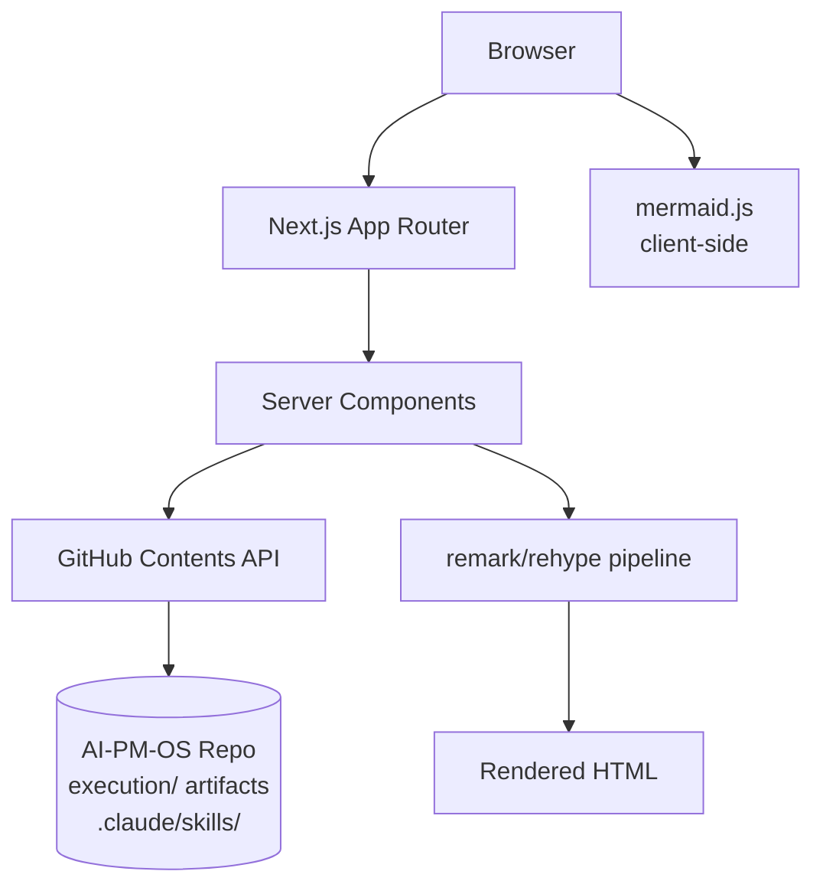

# PM OS Web App

A personal frontend for [PM OS](https://github.com/MJLeach87/AI-PM-OS) — browse and read product artifacts (PRDs, OSTs, IAs, sprint logs) as clean rendered web pages.

**Status**: In Development (Phase 1 — Read Layer)

---

## Features

### Artifact Browsing
- Projects browser — all PM OS initiatives at a glance, searchable, sorted by recency
- Project detail — all artifacts for one initiative with type-based filtering
- Artifact viewer — clean rendered markdown with floating Table of Contents

### Skill Catalog
- Browse all PM OS skills with descriptions and example prompts
- Skill detail pages — full documentation, copy-able invoke commands

### Markdown Rendering
- GitHub-flavored markdown (tables, task lists, strikethrough)
- Syntax-highlighted code blocks
- Mermaid diagram rendering (OSTs, IAs, architecture diagrams)
- Heading anchors for deep linking

---

## Tech Stack

| Layer | Technology | Purpose |
|-------|-----------|---------|
| Framework | Next.js 15 (App Router) | SSR, server components |
| Language | TypeScript (strict mode) | Type safety end-to-end |
| Styling | Tailwind CSS v4 | Utility-first styling |
| Components | shadcn/ui (Radix primitives) | Accessible, consistent UI |
| Data source | GitHub Contents API | Reads `execution/` from AI-PM-OS repo |
| Markdown | remark + rehype | Server-side rendering pipeline |
| Diagrams | mermaid.js | Client-side Mermaid rendering |
| URL state | nuqs | Search and filter params in URL |
| Deployment | Vercel (password-protected) | Auto CI/CD |

---

## Architecture



---

## Project Structure

```
src/
├── app/
│   ├── layout.tsx                # Root layout + sidebar shell
│   ├── page.tsx                  # Projects browser (/)
│   ├── projects/
│   │   └── [slug]/
│   │       ├── page.tsx          # Project detail + artifact list
│   │       └── [artifact]/
│   │           └── page.tsx      # Artifact viewer
│   └── skills/
│       ├── page.tsx              # Skill catalog
│       └── [name]/
│           └── page.tsx          # Skill detail
├── components/
│   ├── ui/                       # shadcn/ui (auto-generated)
│   ├── shared/                   # Sidebar, Header, EmptyState, ToC
│   └── artifacts/                # ProjectCard, ArtifactRow, ArtifactContent, MermaidBlock
├── lib/
│   ├── github.ts                 # GitHub Contents API client
│   ├── artifacts.ts              # Filename parser + phase inference
│   ├── markdown.ts               # remark/rehype pipeline
│   └── utils.ts                  # cn() + shared utils
└── types/
    └── index.ts                  # Project, Artifact, Skill types
```

---

## Getting Started

### Prerequisites

- Node.js 22+
- pnpm 9+
- A GitHub Personal Access Token (repo read scope on `AI-PM-OS`)

### Setup

```bash
# Clone
git clone https://github.com/MJLeach87/pm-os-web.git
cd pm-os-web

# Install dependencies
pnpm install

# Environment setup
cp .env.example .env.local
# Fill in GITHUB_TOKEN, GITHUB_OWNER, GITHUB_REPO

# Start development server
pnpm dev
```

---

## Environment Variables

| Variable | Description | Required |
|----------|------------|----------|
| `GITHUB_TOKEN` | GitHub PAT with `Contents: Read` scope on the AI-PM-OS repo | Yes |
| `GITHUB_OWNER` | GitHub username (e.g., `MJLeach87`) | Yes |
| `GITHUB_REPO` | PM OS repo name (e.g., `AI-PM-OS`) | Yes |

See `PERSONAL_SETUP.md` in the AI-PM-OS repo for token creation instructions.

---

## Scripts Reference

```bash
pnpm dev              # Start dev server (http://localhost:3000)
pnpm build            # Production build
pnpm start            # Start production server
pnpm test             # Unit tests with coverage
pnpm test:watch       # Watch mode for TDD
pnpm tsc --noEmit     # Type check
pnpm biome check .    # Lint + format check
pnpm biome check . --fix  # Auto-fix
```

---

## Deployment

### Vercel Setup

1. Connect this repo to Vercel
2. Set environment variables in Vercel dashboard (`GITHUB_TOKEN`, `GITHUB_OWNER`, `GITHUB_REPO`)
3. Enable Password Protection: Settings → Security → Password Protection
4. Merge to `main` → auto-deploys to production

Artifacts are cached for 5 minutes — changes pushed to AI-PM-OS are visible in the web app within 5 minutes.

---

## How It Works

This app reads directly from the `AI-PM-OS` GitHub repository via the GitHub Contents API. No database — the file system in the GitHub repo is the source of truth.

**Data flow**:
1. Request hits a Next.js server component
2. Server component calls GitHub API: `GET /repos/MJLeach87/AI-PM-OS/contents/execution`
3. Returns directory listing → parsed into Project cards
4. Clicking a project fetches file list for that slug
5. Clicking an artifact fetches the file content (base64 decoded)
6. Markdown is rendered server-side via remark/rehype → clean HTML
7. Mermaid diagrams render client-side after page load

**Caching**: GitHub API responses are cached for 5 minutes via Next.js `fetch` revalidation. Push to AI-PM-OS → visible in web app within 5 minutes.

---

## PM OS Specs

Planning artifacts for this project live in the AI-PM-OS repo:
- **PRD**: `execution/PMOS_pm-os-web-app/2026-03-15_PRD_PM-OS-Web-App-Phase1_v0.1.md`
- **IA**: `execution/PMOS_pm-os-web-app/2026-03-14_IA_PM-OS-Web-App.md`
- **Engineering Standards**: `identity/STANDARDS.md`

---

**PM OS Specs**: `execution/PMOS_pm-os-web-app/` in the [AI-PM-OS](https://github.com/MJLeach87/AI-PM-OS) repo
