# Opportunity Solution Tree: Family Recipe Tracker

**Date**: 2026-02-22
**Project**: RECIPE_recipe-tracker
**Outcome**: Home cooks can effortlessly save, organize, and shop for recipes discovered on Instagram
**Strategy Alignment**: [NEEDS REVIEW — customize `identity/STRATEGY.md` with product vision]

---

## OST Diagram

```mermaid
graph TD
    OUTCOME["🎯 OUTCOME<br/>Home cooks effortlessly save, organize,<br/>and shop for recipes from Instagram"]

    OUTCOME --> OPP1["🔍 OPP 1: Recipes discovered on Instagram<br/>are lost or hard to retrieve later<br/>(Themes 1, 2 — High severity)"]
    OUTCOME --> OPP2["📚 OPP 2: No good way to organize<br/>recipes across cookbooks/themes<br/>(Theme 3 — Medium severity)"]
    OUTCOME --> OPP3["🛒 OPP 3: Translating recipes into<br/>grocery lists requires manual effort<br/>(Theme 4 — Medium severity)"]
    OUTCOME --> OPP4["🥗 OPP 4: Filtering recipes by ingredient<br/>or dietary need is difficult<br/>(Theme 6 — Medium severity, power users)"]

    OPP1 --> SOL1A["✅ SOL 1A: AI-powered Instagram<br/>caption parser (Claude API)<br/>Paste caption → structured recipe"]
    OPP1 --> SOL1B["SOL 1B: Manual recipe entry form<br/>with smart fields (v2)"]
    OPP1 --> SOL1C["SOL 1C: Website URL scraper<br/>for recipe blogs (v2)"]

    OPP2 --> SOL2A["✅ SOL 2A: Cookbook collections<br/>with drag-and-drop organization"]
    OPP2 --> SOL2B["✅ SOL 2B: Tags + full-text search<br/>across all recipes"]
    OPP2 --> SOL2C["SOL 2C: Family sharing with<br/>Google OAuth multi-device access"]

    OPP3 --> SOL3A["✅ SOL 3A: Select recipes →<br/>auto-generate grocery list<br/>(combined quantities)"]
    OPP3 --> SOL3B["SOL 3B: Export/deep-link to<br/>Instacart or Amazon Fresh (v2)"]
    OPP3 --> SOL3C["SOL 3C: Image-to-grocery-list<br/>snap handwritten list → AI parse (v3)"]

    OPP4 --> SOL4A["SOL 4A: Ingredient-level search<br/>and dietary filtering"]
    OPP4 --> SOL4B["SOL 4B: AI substitution suggestions<br/>(e.g., dairy-free alternatives)"]

    style OUTCOME fill:#1a73e8,color:#fff,stroke:#1a73e8
    style OPP1 fill:#e8f0fe,stroke:#1a73e8
    style OPP2 fill:#e8f0fe,stroke:#1a73e8
    style OPP3 fill:#e8f0fe,stroke:#1a73e8
    style OPP4 fill:#e8f0fe,stroke:#1a73e8
    style SOL1A fill:#c8e6c9,stroke:#2e7d32
    style SOL2A fill:#c8e6c9,stroke:#2e7d32
    style SOL2B fill:#c8e6c9,stroke:#2e7d32
    style SOL2C fill:#fff3e0,stroke:#e65100
    style SOL3A fill:#c8e6c9,stroke:#2e7d32
    style SOL1B fill:#fff3e0,stroke:#e65100
    style SOL1C fill:#fff3e0,stroke:#e65100
    style SOL3B fill:#fff3e0,stroke:#e65100
    style SOL3C fill:#f3e5f5,stroke:#7b1fa2
    style SOL4A fill:#fff3e0,stroke:#e65100
    style SOL4B fill:#f3e5f5,stroke:#7b1fa2
```

**Legend**: ✅ Green = MVP scope | Orange = v2 | Purple = v3+

---

## Opportunity Details

### OPP 1: Recipes Discovered on Instagram Are Lost or Hard to Retrieve (HIGH PRIORITY)

**Evidence**: Themes 1 & 2 from Insights
- Instagram is a top recipe discovery channel but has no native recipe-saving functionality
- Users resort to screenshots, bookmarks, notes apps — all unsearchable and fragmented
- Existing recipe apps (Paprika, Whisk) use HTML scraping that doesn't work on Instagram content
- AI parsing of unstructured caption text is the core technical differentiator

**Impact**: This is the #1 pain point and the product's reason to exist. If this doesn't work well, nothing else matters.

**MVP Solution (SOL 1A)**: Paste Instagram caption text → Claude API extracts structured recipe (title, ingredients with quantities/units, steps, servings, prep/cook time) → user reviews and saves with attribution link.

**Key risk**: Claude API parsing accuracy on real Instagram captions. **Must validate with prototype before full build.**

---

### OPP 2: No Good Way to Organize Recipes Across Cookbooks/Themes (MEDIUM PRIORITY)

**Evidence**: Theme 3 from Insights
- Families are multi-person, multi-device — recipes saved on one phone are invisible to others
- Cookbook organization (Italian, Weeknight, Holiday, etc.) is a basic expectation from recipe app users
- Search and filtering become critical once a user has 50+ saved recipes

**MVP Solutions**:
- **SOL 2A**: Cookbooks as named collections; recipes can belong to multiple cookbooks
- **SOL 2B**: Tags + full-text search across recipe titles, ingredients, and notes
- **SOL 2C**: Google OAuth for family-level auth, shared recipe library across devices

---

### OPP 3: Translating Recipes into Grocery Lists Requires Manual Effort (MEDIUM PRIORITY)

**Evidence**: Theme 4 from Insights
- Users manually re-type ingredients into grocery/shopping list apps — duplicated effort, transcription errors
- Meal planning apps solve this but lock users into their own recipe database
- Ingredient quantities need intelligent combination across recipes (2 recipes needing 1 cup butter → 2 cups)

**MVP Solution (SOL 3A)**: Select one or more recipes → auto-generate grocery list with combined quantities, grouped by category (produce, dairy, pantry). Check off items as you shop.

**v2 (SOL 3B)**: Export grocery list to Instacart, Amazon Fresh, or similar for one-click ordering.

---

### OPP 4: Filtering Recipes by Ingredient or Dietary Need (LOWER PRIORITY — v2)

**Evidence**: Theme 6 from Insights
- Households with dietary restrictions need ingredient-level filtering (not just keyword search)
- Cross-recipe ingredient tracking reduces waste and repeat purchases
- AI substitution suggestions are a natural extension of the parsing capability

**v2 Solutions**: Ingredient-level search/filtering + AI substitution suggestions. Requires well-structured ingredient data model from day one (design for this in schema even if features ship later).

---

## Feature Prioritization (RICE Scoring)

| Feature | Reach | Impact | Confidence | Effort | RICE Score | Phase |
|---------|-------|--------|------------|--------|------------|-------|
| AI recipe import (paste caption) | 10 | 3 | Medium | 3 | 10.0 | MVP |
| Recipe CRUD (view, edit, delete) | 10 | 3 | High | 2 | 15.0 | MVP |
| Source attribution | 10 | 2 | High | 1 | 20.0 | MVP |
| Cookbook organization | 8 | 2 | High | 2 | 8.0 | MVP |
| Search & filter | 8 | 2 | High | 2 | 8.0 | MVP |
| Google OAuth | 10 | 2 | High | 2 | 10.0 | MVP |
| Grocery list generation | 7 | 3 | Medium | 3 | 7.0 | MVP |
| Grocery list export (Instacart) | 5 | 2 | Low | 4 | 2.5 | v2 |
| Ingredient-level filtering | 5 | 2 | Medium | 3 | 3.3 | v2 |
| AI substitution suggestions | 4 | 2 | Low | 3 | 2.7 | v2 |
| Manual recipe entry form | 6 | 1 | High | 1 | 6.0 | v2 |
| Website URL scraper | 5 | 1 | Medium | 3 | 1.7 | v2 |
| Image-to-grocery-list | 3 | 2 | Low | 4 | 1.5 | v3 |

*RICE: Reach (1-10) x Impact (1-3) x Confidence (0.5/0.8/1.0) / Effort (1-5)*

---

## MVP Scope Summary

Based on the OST and RICE scoring, the MVP includes:

1. **AI recipe import**: Paste Instagram caption → Claude API parsing → structured recipe
2. **Recipe CRUD**: Create, read, update, delete recipes with all structured fields
3. **Source attribution**: Every imported recipe links back to original Instagram post/creator
4. **Cookbook organization**: Create named collections, assign recipes to cookbooks
5. **Search & filter**: Full-text search across titles, ingredients, tags
6. **Google OAuth**: Family-level authentication for multi-device access
7. **Grocery list generation**: Select recipes → auto-generate combined shopping list

---

## Recommended Next Steps

1. **Validate AI parsing** (highest risk): Build a prototype that tests Claude API against 20-30 real Instagram recipe captions. Measure accuracy on: title extraction, ingredient parsing (name + quantity + unit), step extraction, serving count. Target: >90% accuracy on well-formatted captions.

2. **Run `/feature-pipeline`**: Generate PRD for the MVP scope above. The PRD should cover all 7 MVP features with Gherkin acceptance criteria.

3. **Schema design**: Design the Drizzle/Turso schema with ingredient intelligence in mind (normalized ingredient table, quantity/unit fields) even though ingredient filtering is v2 — the data model is hard to change later.

4. **Competitive install week**: Use Paprika, Whisk, and Samsung Food for a week to map UX patterns and gaps firsthand.

5. **User interviews**: Talk to 5-8 home cooks who save Instagram recipes to validate themes and discover unknown pain points.
