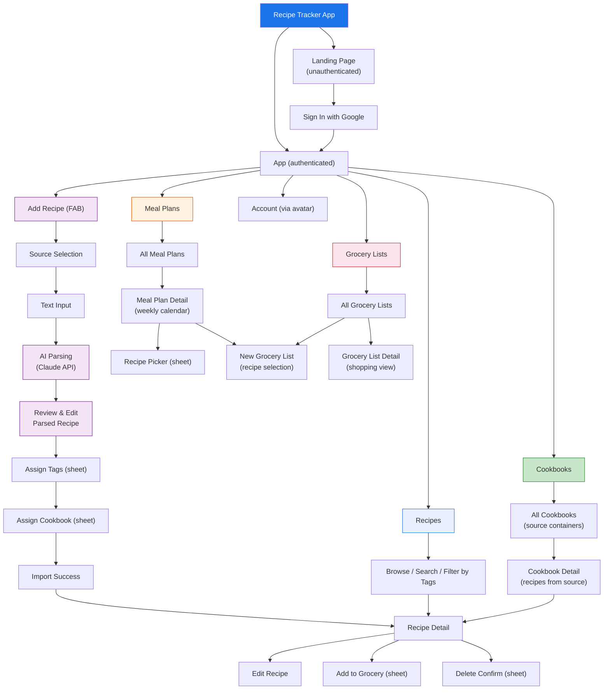
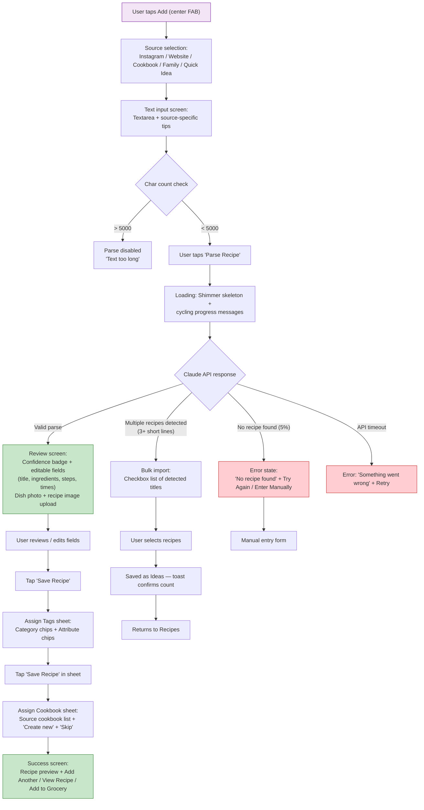
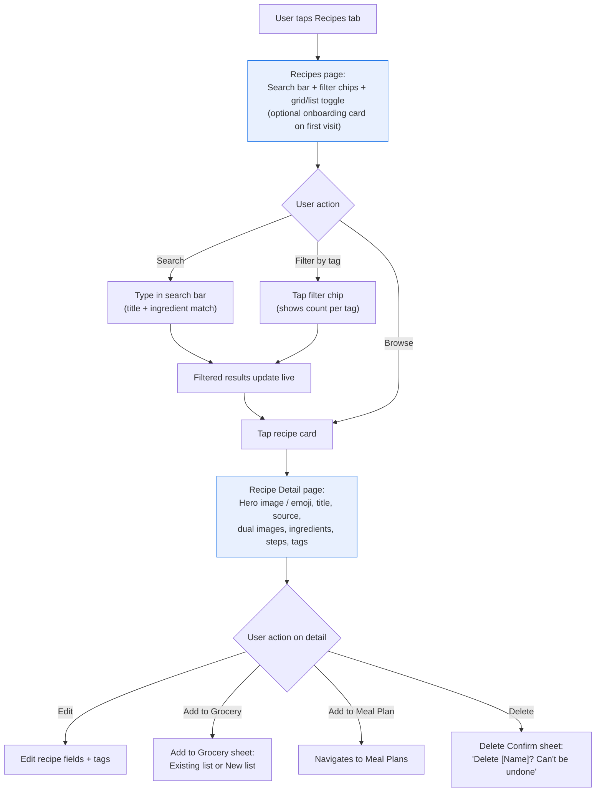
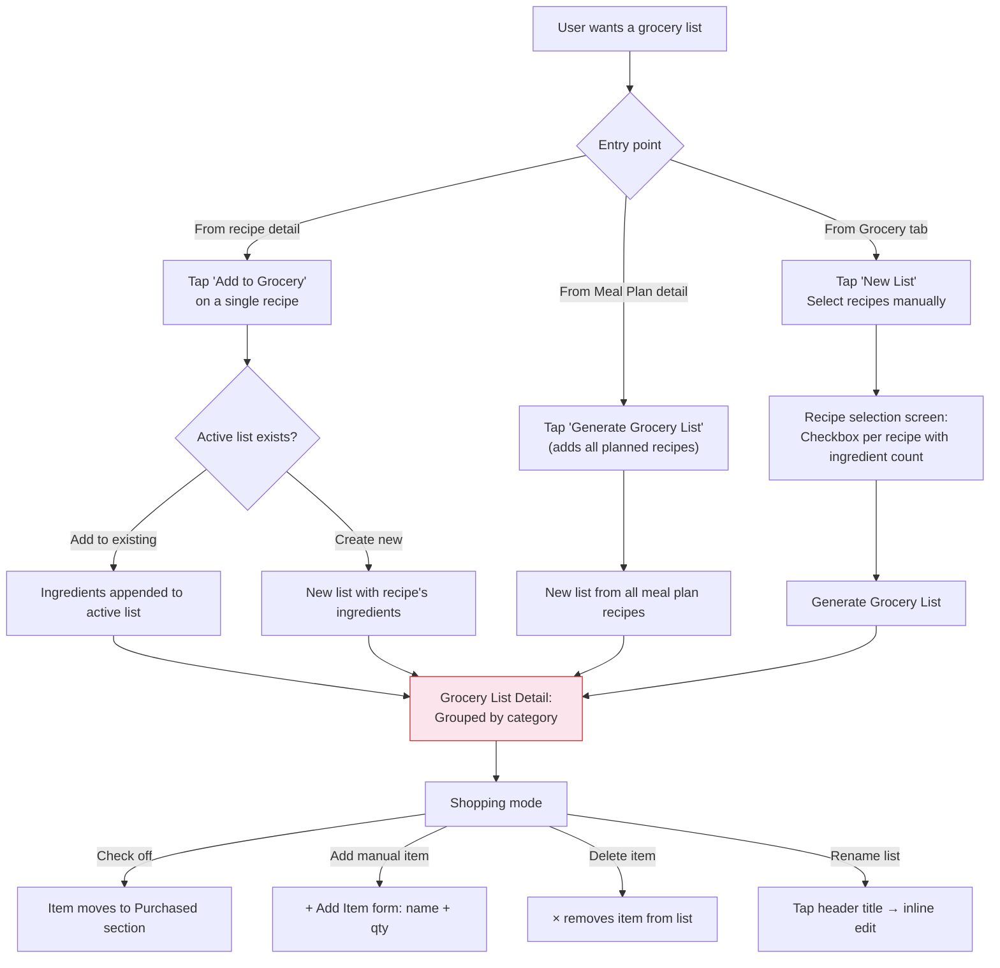
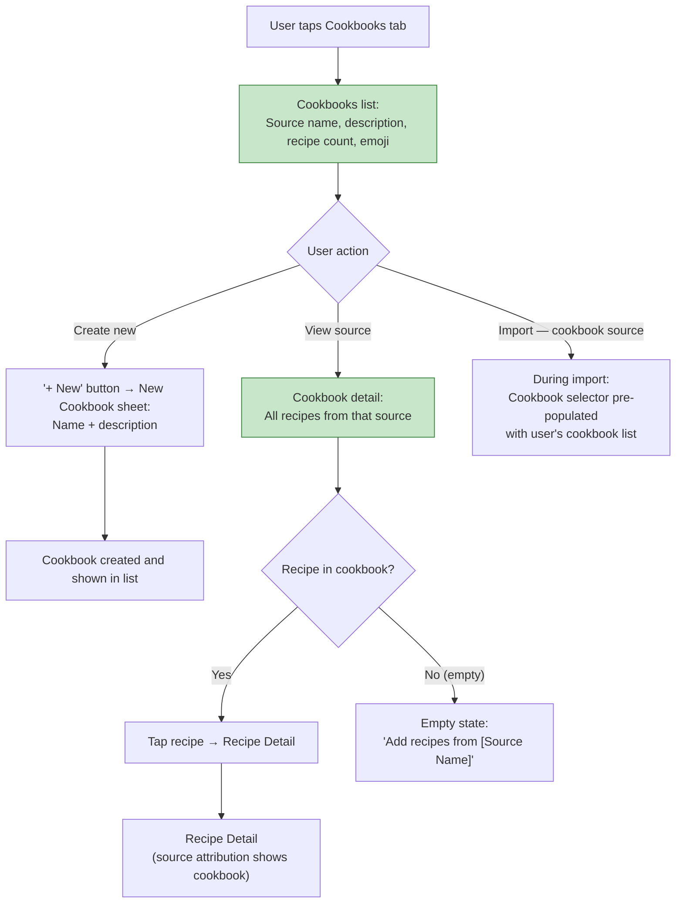
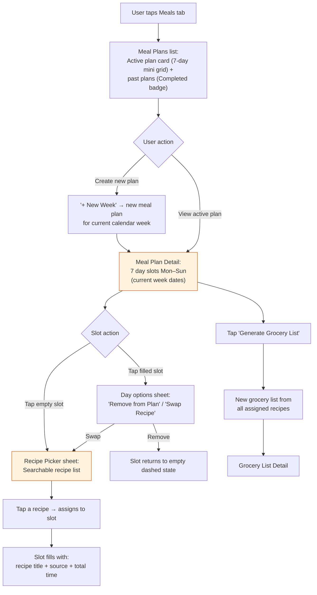
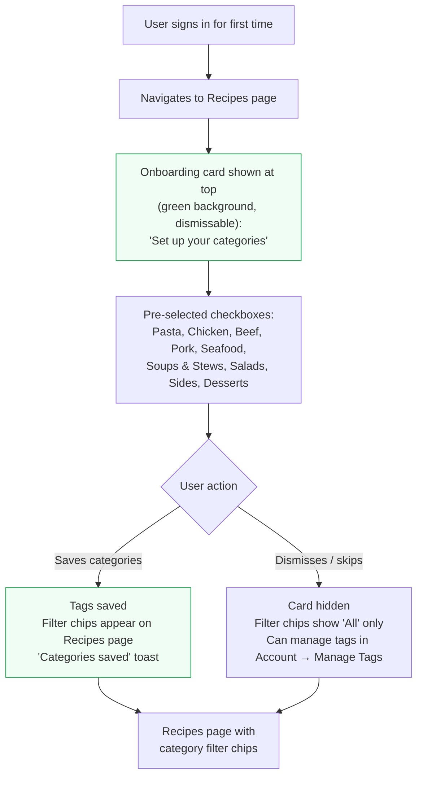

# Information Architecture: Recipe Tracker MVP

**Version**: 1.1
**Date**: 2026-02-24
**Author**: PM OS UX Strategist
**Project**: RECIPE_recipe-tracker
**PRD Reference**: `2026-02-24_PRD_Recipe-Tracker-MVP_v1.1.md`

**Changes from v1.0**:
- Navigation updated: 5 tabs — Recipes, Cookbooks, Add (FAB), Meals, Grocery; Account via header avatar (not a tab)
- Cookbooks reframed as source containers (not category buckets)
- Collections concept removed — Tags handle both category and attribute organization
- Flow 1 updated: tags assignment step added before cookbook step
- Flow 4 updated: cookbooks as source groupings, not category cookbooks
- Flow 5 added: Meal Planning
- Flow 6 added: Onboarding Tag Setup
- Page inventory updated: added Meal Plans screens, removed Collections screens
- Site map updated: Meal Plans node added

---

## 1. Site Map

---

## 2. Primary Navigation

### Bottom Tab Bar (Mobile) / Left Sidebar (Desktop)

The primary navigation uses a persistent bottom tab bar on mobile (the dominant use case for recipe access while cooking or shopping) and a left sidebar on desktop.

| Position | Label | Icon | Route | Description |
|----------|-------|------|-------|-------------|
| 1 | **Recipes** | `BookOpen` | `/recipes` | Browse, search, and filter all saved recipes by tags |
| 2 | **Cookbooks** | `Library` (bookshelf) | `/cookbooks` | Source-based groupings (physical cookbooks, Instagram accounts, blogs) |
| 3 | **Add** | `Plus` (FAB circle) | `/import` | Center action — source selection → parse → save |
| 4 | **Meals** | `Calendar` | `/meals` | Weekly meal planning calendar |
| 5 | **Grocery** | `ShoppingCart` | `/grocery` | Active and past grocery lists |

**Account**: Accessible via the user avatar in the top-right header (not a tab). Avoids crowding the bottom nav, keeps Account separate from core recipe-management actions.

**Design rationale**:
- **Add is center-tab** with a visually prominent circular FAB because adding recipes is the core value loop.
- **Recipes is position 1** (leftmost / default) — browsing and cooking from saved recipes is the most frequent action.
- **Cookbooks is position 2** — source attribution ("that Ina Garten recipe") is the second most common organizational need.
- **Meals and Grocery** complete the weekly cooking workflow: plan → shop → cook.

### Secondary Navigation

- **Within Recipes**: Search bar (always visible) + filter chips (category tags + attribute tags with recipe counts)
- **Within a Recipe Detail**: Back arrow to previous screen; header shows recipe title
- **Within Grocery List**: Sticky header with tappable list name (inline rename)
- **Within Meal Plan Detail**: Day slots Mon–Sun with recipe picker on empty slots

---

## 3. Information Architecture Aligned to User Mental Model

### Analysis of Real User Data (290+ meals)

The user data reveals a clear **protein/category-first** mental model:

| Category | Count | Examples |
|----------|-------|---------|
| **Pasta** | 38 | Butternut squash gnocchi, Lamb Bolognese, Mac and cheese |
| **Chicken** | 39 | Butter Chicken, Chicken Marsala, Thai lettuce wraps |
| **Pork** | 12 | Egg roll bowl, Pork tenderloin, Lemongrass pork lettuce cups |
| **Seafood** | 13 | Shrimp varieties, Baked cod, Scallops, Halibut |
| **Beef** | 20 | Meatballs, Tacos, Pot roast, Steak |
| **Veg / Whole Meals** | 8 | Eggplant parm, Spaghetti squash, Grilled cheese |
| **Casseroles/Pies** | 12 | Shepherd's pie, Chicken pot pies, Pizza |
| **Soups** | 24 | White Chicken Chili, Butternut Squash, Ramen |
| **Vegetables** | 35 | Organized as ingredient:preparation pairs |
| **Sides** | 16 | Potatoes, Rice, Cornbread |
| **Salads** | 28 | Crispy Rice salad, Caesar, Kale salad |

**Key patterns**:
1. **Primary axis is protein/meal type**, not source or cuisine
2. **Source is secondary metadata** — "Defined Dish", "Dinner Tonight", "Comfortable Kitchen", "AK" (Ambitious Kitchen), "ATK" (America's Test Kitchen), "Ina", "Cravings" appear as parentheticals
3. **Variable detail levels** — from "Stir fry" (2 words) to "Hot maple bacon carbonara with sweet potatoes and herby golden bread crumbs (AK)" (full descriptive title)
4. **Sub-variations within entries** — "Shrimp: curried, soy garlic, grilled, Panko/coconut" represents multiple recipes in one line

### How the IA Supports This Mental Model

| User Mental Model | IA Implementation |
|-------------------|-------------------|
| "Show me my pasta dishes" | **Tag** "Pasta" — filter chip on Recipes page |
| "What can I make with chicken?" | **Search** "chicken" hits both titles and ingredients |
| "That Defined Dish recipe" | **Cookbook** named "The Defined Dish" — browse all recipes from that source |
| "Quick weeknight ideas" | **Tag** "Weeknight" + **Tag** "Quick" — combinable filter chips |
| "I just want to save the name for now" | **AI Import** handles brief ideas; marks as "Idea" tag |
| "I have 5 recipes to add from this cookbook" | **Bulk import** mode — paste multiple lines, creates one entry per line |
| "What am I cooking this week?" | **Meal Plans** — assign recipes to each day Mon–Sun |

### Two Organizational Axes

**Tags** handle the *what* — the meal type and attributes users search by:
- **Category tags** (meal type): Pasta, Chicken, Beef, Pork, Seafood, Soups & Stews, Salads, Sides, Desserts, Vegetarian
- **Attribute tags**: Weeknight, Quick (≤30m), One-Pan, Freezer-Friendly, Special Occasion

**Cookbooks** handle the *where it came from* — the source of the recipe:
- Physical cookbooks (The Defined Dish, Barefoot Contessa, Jerusalem Cookbook)
- Instagram accounts / food bloggers (Ambitious Kitchen, Half Baked Harvest)
- Family recipes, personal notes

A recipe has tags AND belongs to a cookbook — these are orthogonal. "Harvest Kale and Farro Salad" has tags [Salads, Vegetarian] and belongs to "The Defined Dish" cookbook.

### Default Tags (Onboarding Suggestion)

During first sign-in, show a "Set up your categories" card with pre-populated checkboxes:
- Pasta, Chicken, Beef, Pork, Seafood, Soups & Stews, Salads, Sides, Desserts (pre-checked)
- User can deselect, and add more

Selected tags become the filter chips on the Recipes page immediately.

---

## 4. Key User Flows

### Flow 1: Paste Text → Parse → Review → Tags → Cookbook → Save

This is the core value loop — the primary reason users choose this app over alternatives.

**Screen inventory for this flow**:

| Screen | Key Elements |
|--------|-------------|
| **Source Selection** | 5 source option cards: Instagram, Website, Cookbook, Family, Quick Idea |
| **Text Input** | Textarea, character counter (warn at 4500+, disable at 5001+), source-specific tip, cookbook selector (for cookbook source), Parse Recipe button |
| **Parsing (loading)** | Shimmer skeleton, cycling progress messages ("Reading text...", "Extracting ingredients...", "Almost done..."), Cancel button |
| **Review** | Confidence badge (High/Medium/Low), editable Title, editable Description, Servings/Prep/Cook fields, editable Ingredient rows (qty + unit + name), editable Step textareas, Dish Photo upload, Recipe Page Image upload (cookbook source), Source attribution |
| **Assign Tags (sheet)** | Category tag checkboxes, Attribute tag checkboxes, Save Recipe button |
| **Assign Cookbook (sheet)** | Cookbook list with source emojis, "Create new cookbook" option, Skip button |
| **Bulk Import** | Detected recipe names as checkboxes, "Import Selected as Ideas" button |
| **Error** | Error message, "Try Again" button, "Enter Manually" link |
| **Success** | Recipe card preview, "Add Another", "View Recipe", "Add to Grocery" |

### Flow 2: Browse Recipes → Filter → View → Act

**Recipe card** shows: emoji placeholder (or dish photo), title, source, 1-2 tag chips. Filter chips show recipe counts: "Pasta (4)", "Chicken (3)".

**Recipe detail** shows: hero image or emoji placeholder (large), title, source attribution (cookbook name + page if applicable), description, servings/prep/cook/total time, Recipe Source card (recipe image if available), tags, ingredient list, numbered steps, action buttons.

**Dual image display**:
- `imageUrl` (dish photo) → hero image at top of detail, card thumbnail
- `recipeImageUrl` (recipe page photo) → shown in "Recipe Source" collapsible card below description; tappable to view full-size

### Flow 3: Select Recipes → Generate Grocery List

**Grocery list detail** layout:

| Section | Content |
|---------|---------|
| **Header** | Tappable list name (inline rename), items remaining count |
| **Category sections** | Produce, Dairy, Meat, Pantry (each as label + item rows) |
| **Per item** | Checkbox, ingredient name + quantity, source recipe badge, × delete button (on hover/tap) |
| **Purchased** (appears when items checked) | Checked items with count badge, "Clear" action |
| **Extras** | Manually added items with "manual" badge |
| **Add Item form** | Name + qty inputs (shown inline when + Add Item tapped) |

### Flow 4: Browse Cookbooks (Source Containers)

**Cookbook as source container**: Each cookbook represents one source. During import, the cookbook selector shows all user cookbooks. The user assigns the new recipe to the relevant source. On the recipe detail, "From [Cookbook Name]" + page number if applicable.

**Creating cookbooks**: Users create cookbooks for each source they use. Suggested names during onboarding: The Defined Dish, Barefoot Contessa, Ambitious Kitchen, Jerusalem Cookbook, Instagram Saves, Family Recipes. User customizes the list.

### Flow 5: Meal Planning

**Meal plan detail** layout:
- 7 day slots, each showing: day label (MON, TUE...) + date number
- Empty slot: dashed border, "+ Assign a meal" text
- Filled slot: recipe title (bold), source + total time (gray)
- "Generate Grocery List" button at bottom

**Recipe picker sheet**: Full recipe list with search. Tapping any recipe immediately assigns it to the day slot and closes the sheet.

### Flow 6: Onboarding Tag Setup (First Sign-In)

**Onboarding card behavior**:
- Shown once on first authenticated recipes page visit
- Pre-populated with common category tags (all pre-checked)
- User can deselect any before saving
- "Skip" / × button dismisses without saving
- After saving: card hides, filter chips show selected tags with recipe counts
- Can add/remove tags anytime via Account → Manage Tags

---

## 5. Page Inventory

| Page | Route | Purpose | Key Components |
|------|-------|---------|----------------|
| Landing | `/` | Marketing + sign-in | Hero, value props (AI import, ingredient search, grocery lists), Google Sign In |
| Recipes | `/recipes` | Default authenticated view — browse all recipes | Onboarding card (first visit), search bar, filter chips with counts, grid/list toggle, recipe cards |
| Recipe Detail | `/recipes/[id]` | Full recipe view + actions | Hero image/emoji, title, source attribution, dual images, ingredients, steps, tags, action buttons |
| Recipe Edit | `/recipes/[id]/edit` | Edit recipe fields | Title, description, servings/times, tag checkboxes |
| Import — Source | `/import` | Source type selection | 5 source option cards |
| Import — Text | `/import/text` | Text input + parse | Textarea + char counter + tips + Parse button |
| Import — Parsing | `/import/parsing` | AI parsing loading state | Shimmer skeleton + cycling messages + Cancel |
| Import — Review | `/import/review` | Review + edit parsed recipe | Confidence badge, editable fields, dish photo + recipe image upload |
| Import — Error | `/import/error` | Parse error state | Error message + Try Again + Enter Manually |
| Import — Bulk | `/import/bulk` | Multiple recipes detected | Checkbox list of titles + "Import as Ideas" |
| Import — Success | `/import/success` | Confirmation | Recipe card preview + quick actions |
| Cookbooks | `/cookbooks` | Source-container list | Cookbook cards with emoji, name, desc, recipe count |
| Cookbook Detail | `/cookbooks/[id]` | All recipes from a source | Recipe list with page numbers + empty state CTA |
| Meal Plans | `/meals` | Meal plan list | Active plan card (mini calendar grid), past plans |
| Meal Plan Detail | `/meals/[id]` | Weekly meal calendar | 7 day slots, recipe picker sheet, Generate Grocery List |
| Grocery Lists | `/grocery` | Grocery list management | Active + past list cards |
| Grocery Detail | `/grocery/[id]` | Shopping checklist | Categorized items, purchased section, manual add, rename |
| Grocery New | `/grocery/new` | Create grocery list | Recipe selection checkboxes + Generate |
| Account | (via avatar) | Profile + settings | Avatar, stats, Manage Cookbooks, Manage Tags, Export, Sign Out |

---

## 6. Responsive Breakpoints

| Breakpoint | Layout | Navigation |
|------------|--------|------------|
| **Mobile** (< 640px) | Single column, max-width 430px, bottom tab bar | 5-tab bottom nav + FAB |
| **Tablet** (640px–1024px) | 2-column recipe grid | Bottom tab bar |
| **Desktop** (> 1024px) | 3-4 column recipe grid | Left sidebar with same 5 items + Account at bottom |

Mobile is the primary design target because:
- Recipes are accessed while cooking (phone on counter)
- Grocery lists are used while shopping (phone in hand)
- Instagram recipe discovery happens on mobile

---

## 7. Accessibility Notes

- All interactive elements are keyboard-navigable
- Recipe cards use semantic `<article>` elements with `aria-label`
- Filter states are announced to screen readers
- Grocery list checkboxes have associated `<label>` elements
- Color is never the sole indicator of state (confidence badges use icon + text + color)
- Touch targets minimum 44×44px on mobile
- Bottom sheet backdrops trap focus while open (focus returns to trigger on close)
- High contrast mode support via Tailwind `dark:` variants (v2)

---

**Prototype**: `2026-02-24_Prototype_Recipe-Tracker-MVP.html` — interactive single-file HTML prototype covering all 6 flows
