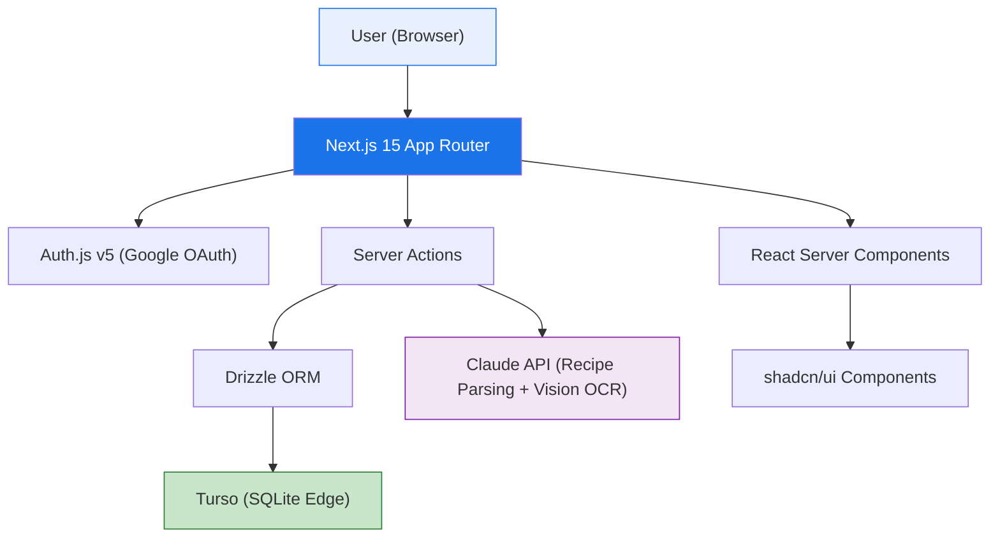
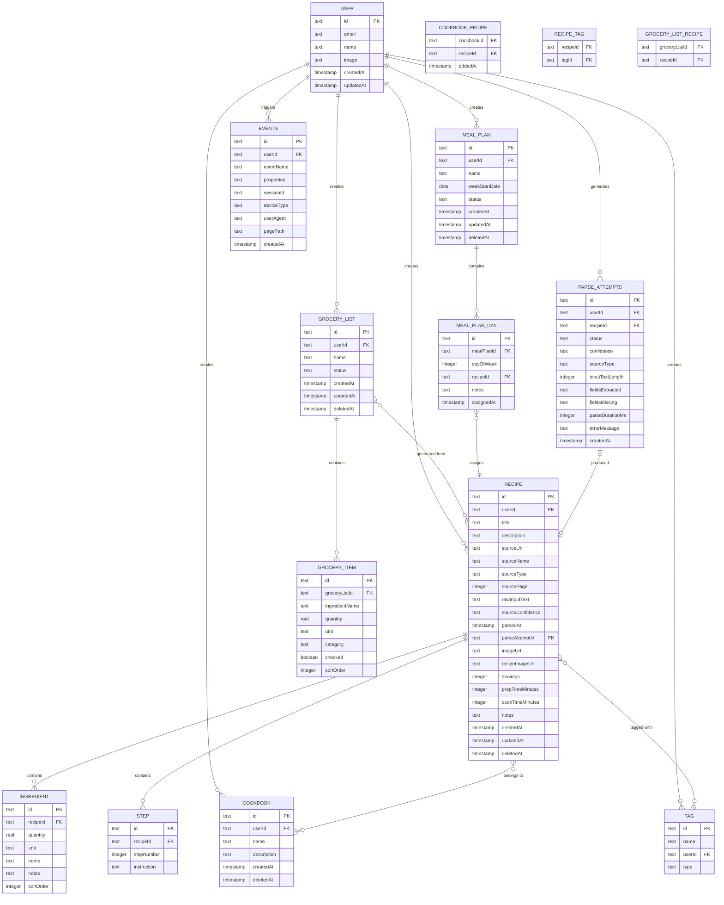

# PRD: Recipe Tracker MVP

**Version**: 1.1 (Scope update — Meal Plans, Tags consolidation, dual images)
**Date**: 2026-02-24
**Author**: PM OS Product Architect
**Project**: RECIPE_recipe-tracker
**Status**: Ready for implementation
**Strategy Alignment**: [NEEDS REVIEW — customize `identity/STRATEGY.md`]

**Specialist Inputs Incorporated**:
- Engineering Partner: Feasibility + Security Assessment (`2026-02-24_Feasibility_Recipe-Tracker-MVP.md`)
- UX Strategist: Information Architecture + Prototype (`2026-02-24_IA_Recipe-Tracker-MVP.md`, `2026-02-24_Prototype_Recipe-Tracker-MVP.html`)
- Data Analyst: Metrics Validation + Instrumentation Plan (`2026-02-24_MetricsValidation_Recipe-Tracker-MVP.md`)
- GTM Strategist: Value Proposition + Competitive Positioning (`2026-02-22_ValueProp_Recipe-Tracker-MVP.md`)

**Changes from v1.0**:
- Added Feature 8: Meal Planning (weekly calendar, recipe assignment, grocery generation)
- Revised Feature 4: Cookbooks are now source containers (physical books, Instagram accounts, blogs, family), not just category buckets
- Collections concept removed — replaced by Tags (dual-purpose: category + attribute)
- Dual recipe images added: `imageUrl` (dish photo) + `recipeImageUrl` (recipe page/source photo)
- Data model updated: `MEAL_PLAN`, `MEAL_PLAN_DAY` tables; `recipeImageUrl` column on `RECIPE`
- Navigation updated: 5 tabs — Recipes, Cookbooks, Add (FAB), Meals, Grocery; Account via header avatar
- Sprint plan updated: Sprint 3 now includes Meal Plans
- Open questions updated: Cookbooks vs Collections resolved

---

## 1. Business Case

### Problem

Home cooks collect recipes from many sources — cookbooks, Instagram, food blogs, family tradition — but have no unified, structured, searchable system to organize them. They resort to handwritten lists, screenshots, bookmarks, and notes apps — all fragmented and impossible to cook or shop from efficiently. (Evidence: Insights Themes 1-2; User Data: real 290+ meal list organized in a flat markdown file by protein category)

Real user data shows recipe collections span 8+ cookbook sources (Defined Dish, Dinner Tonight, Comfortable Kitchen, Ambitious Kitchen, America's Test Kitchen, Ina Garten, Cravings, and more) alongside Instagram discoveries. The problem is broader than any single platform. (Evidence: User Data — Meal Inspiration List, 2026-02-22)

Existing recipe apps (Paprika, Whisk, Samsung Food) rely on website HTML scraping with structured data (JSON-LD). This fails on Instagram and doesn't help with cookbook recipes or brief meal ideas like "Stir fry" or "Pot roast." (Evidence: Insights Theme 2)

The result: recipes are lost, duplicated effort occurs when building grocery lists manually, and families can't share recipes across devices. (Evidence: Insights Themes 3-4)

### Solution

A family recipe tracker that uses **AI (Claude API) to parse any text into structured recipe data** — from detailed Instagram captions to cookbook recipes to brief meal ideas. Paste any text, photograph a cookbook page (OCR), or enter a quick idea. AI extracts what it can, user reviews and saves. Organize by source (cookbooks) and by meal type (tags), plan your week with a meal calendar, and auto-generate grocery lists.

### Value Proposition (GTM Strategist)

> **Every recipe you find, from anywhere, organized and shoppable in seconds.**

Three value pillars:
1. **Universal Import** — Any text, any source, any detail level. OCR from cookbook photos.
2. **Structured and Searchable** — Ingredients stored as structured data, not text blobs. Search by what's in the recipe.
3. **Grocery Lists That Write Themselves** — Assign meals to your week. Get a combined shopping list.

### Competitive Positioning

| Competitor | Their Strength | Our Advantage |
|-----------|---------------|---------------|
| **Paprika** | Mature recipe management, grocery lists | AI handles any text, not just URLs. OCR from cookbook photos. |
| **Whisk / Samsung Food** | Samsung integration, visual discovery | Platform-agnostic. Focuses on user's existing collection. |
| **Mealime** | Meal planning + grocery lists | Bring-your-own-recipes model. Import from any source. |
| **AnyList** | Strong grocery list app | Recipe import is core, not add-on. AI parsing of unstructured text. |
| **Notes app / screenshots** | Zero friction | Structured data: searchable, shoppable, cross-device. |

### Why Now

- LLM capabilities (Claude API + Vision) make unstructured text parsing AND OCR viable at consumer-grade accuracy for the first time
- No competitor handles the full spectrum from detailed recipe text to brief meal ideas to cookbook photos
- The tech stack (Next.js 15 + Turso + Vercel) enables a solo dev to ship and scale a production app quickly

### Target Users

**Primary: Multi-Source Recipe Collectors** — Home cooks (25-45) who collect recipes from 5+ sources (cookbooks, Instagram, food blogs, family) and want one organized, searchable, shoppable place for all of them. Typically part of a family household with multiple cooks/shoppers.

**Secondary: Cookbook Enthusiasts** — Home cooks (30-55) with 5+ physical cookbooks who want a digital index with page number references.

**Characteristics**:
- Cook 3-7 meals per week from recipes (not improvising)
- Organize mentally by meal type/protein (pasta, chicken, seafood, soups) not by source
- Currently use a patchwork of handwritten lists, screenshots, bookmarks, and notes apps
- Google ecosystem users (Gmail, Google Calendar, Android or cross-platform)

---

## 2. Metrics

### Primary Success Metrics

| Metric | Target | Measurement | Timeframe | Data Analyst Notes |
|--------|--------|-------------|-----------|-------------------|
| **AI Parse Success Rate** | >90% accuracy on well-formatted text | Non-error responses / total parse attempts + % saved without editing as accuracy proxy | Ongoing | Requires `parse_attempts` table (not in base schema) |
| **Recipes Saved per User per Week** | >3 recipes/user/week (active users) | Count of saved recipes per user | After 30 days | Measurable with existing schema. Bulk imports may inflate — track separately. |
| **Weekly Active Users (WAU)** | 50 WAU within 60 days (100 aspirational) | Action-based: distinct users with any write action in past 7 days | Post-launch | Revised from session-based to action-based per Data Analyst recommendation |
| **Grocery List Generation Rate** | >30% of active users generate >=1 list/week | Users who create grocery lists / WAU | After **60** days | Moved from 30 to 60 days — users need 10+ recipes before grocery lists become useful |

### Secondary Metrics

| Metric | Target | Measurement | Notes |
|--------|--------|-------------|-------|
| **Recipe Edit Rate Post-Parse** | <40% of parsed recipes need manual correction | Recipes edited within 5 min of parse / total parses | Requires `events` table for edit tracking |
| **Cookbook Creation Rate** | >50% of users create >=1 cookbook | Users with >=1 cookbook / total registered users | Achievable with onboarding cookbook suggestions |
| **Meal Plan Creation Rate** | >20% of active users create >=1 meal plan/month | Users with >=1 meal plan / WAU | New in v1.1 — after 60 days when library has enough recipes |
| **Multi-Device Usage** | >20% of users access from 2+ device types/week | Per-user (not per-household) until family accounts exist | Requires device fingerprint in session events |
| **Time to First Recipe** | <3 minutes from sign-up | Median `user.createdAt` to `MIN(recipe.createdAt)` | Measurable with existing schema |
| **Day 7 / Day 30 Retention** | D7: >40%, D30: >20% | % of sign-up cohort active N days later | Added per Data Analyst recommendation |

### North Star Metric (Data Analyst)

**Recipes Saved per Active User per Month** — monthly smoothing reduces weekly variance.

### Instrumentation Requirements

- **New `parse_attempts` table**: Tracks every AI parse (input length, duration, confidence, fields extracted/missing, error details)
- **New `events` table**: Generic event tracking for behavioral analytics (recipe viewed/edited, search performed, grocery item checked, meal plan created)
- **Persist `confidence` on recipe**: Add `sourceConfidence` and `parsedAt` columns to `recipe` table
- Track recipe lifecycle: created, viewed, edited, added to cookbook, tagged, used in meal plan, used in grocery list, deleted
- Track grocery list lifecycle: created, items checked off, completed, abandoned (>7 days inactive with unchecked items)
- Track meal plan lifecycle: created, recipes assigned, grocery list generated from it
- Session tracking: device type (via user-agent), referrer

See `2026-02-24_MetricsValidation_Recipe-Tracker-MVP.md` for full instrumentation plan, event taxonomy, and SQL queries.

---

## 3. Approach

### Architecture Overview



### Data Model (Drizzle Schema)



### Schema Changes from v1.0 (v1.1 additions)

| Change | Rationale |
|--------|-----------|
| Added `recipeImageUrl` to `RECIPE` | Dual image support: `imageUrl` = dish photo, `recipeImageUrl` = recipe page/source photo |
| Added `MEAL_PLAN` table | Weekly meal calendar (Feature 8) |
| Added `MEAL_PLAN_DAY` table | Day-to-recipe assignment within a meal plan |
| Added `type` to `TAG` | Distinguish category tags (pasta, chicken) from attribute tags (weeknight, quick) |

### Schema Changes from v0.1 (Engineering Partner + Data Analyst, incorporated in v1.0)

| Change | Source | Rationale |
|--------|--------|-----------|
| Added `deletedAt` to recipe, cookbook, grocery_list | Engineering Partner | Soft delete — enables undo, prevents accidental data loss |
| Added `imageUrl` to recipe | Engineering Partner | Future-proofing — avoids schema migration when image support ships |
| Added `updatedAt` to user, grocery_list | Engineering Partner | Standard audit trail |
| Added `status` to grocery_list | Engineering Partner | Track active/completed/archived |
| Added `sourceConfidence`, `parsedAt`, `parseAttemptId` to recipe | Data Analyst | Enables parse accuracy metrics |
| Added `parse_attempts` table | Data Analyst | Required for AI Parse Success Rate metric |
| Added `events` table | Data Analyst | Required for WAU, retention, funnel, and behavioral metrics |
| Use `cuid2` for IDs, not UUIDs | Engineering Partner | 25 chars vs 36 — better for SQLite |

### Design Decisions

- **Cookbooks = source containers, not categories**: Cookbooks represent the *origin* of a recipe — a physical cookbook (Defined Dish, Ina Garten), an Instagram account, a food blog, or a family source. Users want to say "show me everything from Defined Dish." This is meaningfully different from category organization (pasta, chicken), which Tags handle. A recipe can belong to both a cookbook ("from The Defined Dish") and have category tags ("Salads", "Vegetarian").
- **Tags replace Collections**: The earlier "Collections" concept (custom user-curated groupings) is eliminated. Tags serve dual purposes: (1) category tags — meal types like Pasta, Chicken, Salads, Sides, Desserts that drive the filter chips; (2) attribute tags — cross-cutting attributes like Weeknight, One-Pan, Quick, Freezer-Friendly. The `TAG.type` column distinguishes these. This simplification removes one organizational layer while preserving all organizational value.
- **Dual recipe images**: Each recipe has two optional image fields: `imageUrl` for a photo of the finished dish (visual appeal, used as card thumbnail), and `recipeImageUrl` for a photo of the recipe source — a cookbook page scan, a screenshot of an Instagram post. This enables OCR-based import (photograph the cookbook page) while also letting users attach a beautiful dish photo later.
- **Normalized ingredients**: Each ingredient is a separate row with `quantity`, `unit`, `name` — enables grocery list quantity combination and future ingredient-level search (v2)
- **Source attribution model**: `sourceType` (enum: `instagram`, `cookbook`, `website`, `family`, `other`) + `sourceName` + `sourceUrl` + `sourcePage`. Real user data shows cookbook page refs like "Coleslaw - defined dish (p262)"
- **Raw input preserved**: `rawInputText` stored for re-parsing if AI model improves
- **Many-to-many cookbooks**: Recipes can belong to multiple cookbooks via junction table
- **Grocery items denormalized**: `ingredientName`/`quantity`/`unit` copied (not FK to ingredient) because users modify grocery lists independently of recipes
- **Ingredient unit normalization deferred**: MVP concatenates same-name ingredients with different units ("Butter: 1 cup, 4 tbsp") rather than attempting math. Proper unit conversion is an L/XL effort.
- **Auth.js user table is source of truth**: Extend Auth.js's user table rather than creating a parallel one
- **Duplicate detection deferred**: Title + ingredient matching is fragile. MVP shows recently added recipes prominently for self-detection. Revisit with fuzzy matching in v2.

### Alternatives Considered

| Alternative | Rejected Because |
|-------------|-----------------|
| PostgreSQL/Supabase | Unnecessary complexity for MVP; Turso's SQLite model is simpler and cheaper |
| Store recipes as JSON blobs | Loses queryability; can't do ingredient-level search, quantity combination |
| Instagram API integration | Instagram API requires app review, rate limits, and doesn't expose caption text reliably |
| Browser extension | Higher distribution friction; web app works on all devices immediately |
| Session-based WAU | Requires client-side session tracking infrastructure; action-based WAU is simpler and sufficient for MVP |
| Collections as separate concept | Adds organizational complexity without clear value; Tags handle both category + attribute organization |

### Technical Risk Summary (Engineering Partner)

| Risk | Severity | Mitigation |
|------|----------|------------|
| Claude API parsing accuracy | High | Use tool-use mode (structured output), Zod validation, always show user review before save |
| Auth.js v5 configuration | Medium | Start auth in Sprint 1; test Drizzle adapter with Turso early |
| Ingredient quantity combination | Medium | Defer unit normalization; concatenate mismatched units |
| API key exposure | Critical | Server Actions only; never import Anthropic SDK in client components; verify with `next build` bundle search |
| IDOR (user accessing other's recipes) | High | Every query includes `WHERE userId = session.user.id`; create `requireAuth()` helper |

### Security Requirements (Engineering Partner — OWASP/STRIDE)

Before launch, verify:
- [ ] Claude API key never appears in client bundle (`next build` + search output for `sk-ant-`)
- [ ] Every Server Action checks `session.user.id` ownership
- [ ] Rate limiting on AI parse endpoint (10/min/user, 50/day/user)
- [ ] Security headers configured in `next.config.ts` (nosniff, X-Frame-Options: DENY, HSTS)
- [ ] `pnpm audit` with zero critical vulnerabilities
- [ ] IDOR test: sign in as User A, attempt to access User B's recipes via direct URL
- [ ] Input sanitization: strip HTML from pasted text, validate `sourceUrl` starts with `https://`

---

## 4. Details

### Feature 1: AI Recipe Import (Any Text Source + OCR)

**Description**: User pastes any text — or photographs a cookbook page — and Claude API extracts structured recipe data. The AI adapts to input quality: full parsing for detailed text, title-only for brief ideas. User reviews and saves.

**Complexity**: High (Engineering Partner) | **Effort**: L (4-6 dev days)

```gherkin
Feature: AI Recipe Import

  Scenario: Parse a detailed recipe (Instagram caption, blog post, cookbook)
    Given I am logged in
    When I paste text containing a full recipe with ingredients and instructions
    And I click "Parse Recipe"
    Then the system sends the text to Claude API
    And displays the parsed recipe with title, ingredients, steps, servings, and times
    And I can review and edit each field before saving

  Scenario: Parse a brief meal idea
    Given I am logged in
    When I paste a brief meal idea like "Butternut squash gnocchi"
    Then the system creates a recipe with the title extracted
    And marks ingredients and steps as empty for the user to fill in later
    And tags it as "Idea" so the user knows it's incomplete

  Scenario: Parse a list of meals (bulk import)
    Given I am logged in
    When I paste a list of multiple meal names (one per line)
    Then the system detects multiple recipes and offers to create them as separate entries
    And each entry gets the title parsed, with empty ingredients/steps

  Scenario: Parse text with no recipe content at all
    Given I am logged in
    When I paste text that contains no recipe or meal content
    Then the system displays a message: "No recipe found in this text."
    And does not create a recipe

  Scenario: Add source attribution
    Given I am adding a recipe from any source
    When I optionally enter the source URL, source name, or cookbook name
    Then the saved recipe displays source attribution
    And if a URL was provided, it links to the original

  Scenario: Import from cookbook photo (OCR)
    Given I am logged in
    When I take a photo of a cookbook page or upload an image
    Then the system extracts text from the image via OCR (Claude Vision API)
    And sends the extracted text to the AI recipe parser
    And displays the parsed recipe for review
    And the cookbook page photo is stored as recipeImageUrl

  Scenario: Save dish photo separately from recipe source image
    Given I am reviewing a parsed recipe before saving
    When I upload a photo of the finished dish
    Then it is saved as imageUrl and used as the card thumbnail
    And the recipe page photo (if any) is stored separately as recipeImageUrl
    And both appear on the recipe detail screen
```

**AI Parsing Contract** (Claude API prompt structure):
- Input: raw text (string, max 5000 chars) OR image (JPEG/PNG, max 10 MB — processed via Claude Vision API)
- Output: JSON with `title`, `ingredients[]` (each with `name`, `quantity`, `unit`), `steps[]`, `servings`, `prepTimeMinutes`, `cookTimeMinutes`, `confidence` (high/medium/low)
- **Use tool-use mode** (function calling) for structured output rather than free-form JSON generation
- **Adaptive parsing**: AI returns `confidence: "low"` for brief inputs; `confidence: "high"` for full recipe text
- Validation: Zod schema validates Claude API response before displaying to user
- Fallback: if parsing fails or returns invalid JSON, show error and let user enter manually
- **Model selection**: Benchmark Claude Haiku vs. Sonnet against 20-30 real inputs. Use Haiku if it meets 85% accuracy threshold.

**UX**: Import is center-tab (FAB pattern) in bottom navigation. Source selection screen (Instagram, Website, Cookbook, Family, Quick Idea) → text input → parse → review (editable) → assign tags → assign cookbook → saved. See `2026-02-24_IA_Recipe-Tracker-MVP.md` Flow 1 and `2026-02-24_Prototype_Recipe-Tracker-MVP.html`.

### Feature 2: Recipe CRUD

**Complexity**: Low | **Effort**: S (2-3 dev days)

```gherkin
Feature: Recipe Management

  Scenario: View all recipes
    Given I am logged in and have saved recipes
    When I navigate to the recipes page
    Then I see a grid/list of my recipes with title, source, tag chips, and an emoji placeholder if no dish photo exists

  Scenario: View a single recipe
    Given I am viewing a recipe
    Then I see the full recipe: dish photo (if available), title, source attribution, ingredients, steps, times, tags
    And if a recipe source image exists (cookbook page scan), it appears in a "Recipe Source" card below the hero

  Scenario: Edit a recipe
    Given I am viewing a recipe I created
    When I click "Edit"
    Then I can modify title, ingredients, steps, servings, times, notes, and tags
    And save changes

  Scenario: Delete a recipe
    Given I am viewing a recipe I created
    When I click "Delete" and confirm in a confirmation sheet
    Then the recipe is soft-deleted (deletedAt set) and no longer visible
```

**UX**: Recipes page is position 1 (default tab). Recipe cards show title, source, 1-2 tag chips, emoji placeholder or dish photo. Filter chips on recipes page show recipe counts per tag. See IA Section 4, Flow 2.

### Feature 3: Source Attribution

**Complexity**: Low | **Effort**: S (0.5-1 dev day)

```gherkin
Feature: Source Attribution

  Scenario: Recipe shows cookbook source with page number
    Given a recipe was imported from "Defined Dish" at page 262
    Then the recipe detail page shows "From The Defined Dish, p. 262"
    And no link is shown (cookbooks don't have URLs)

  Scenario: Recipe shows Instagram source
    Given a recipe was imported from Instagram
    Then the recipe detail shows "From Instagram" with the account name if provided

  Scenario: Recipe shows website source with URL
    Given a recipe was imported with a source URL
    Then the recipe detail shows "From [Source Name]" linking to the original in a new tab
```

### Feature 4: Cookbook Organization (Source Containers)

**Description**: Cookbooks represent the *source* of a recipe — a physical cookbook, an Instagram account, a food blog, or a family source. Users want to see all recipes from a given source in one place. A recipe can belong to one or more cookbooks.

**Complexity**: Low | **Effort**: S (1-2 dev days)

```gherkin
Feature: Cookbook Organization

  Scenario: Create a cookbook for a physical cookbook source
    Given I am logged in
    When I create a new cookbook named "The Defined Dish"
    Then it appears in my cookbooks list with name and description

  Scenario: Create a cookbook for an Instagram account
    Given I am logged in
    When I create a new cookbook named "Half Baked Harvest"
    Then it represents all recipes I've saved from that account
    And appears in my cookbooks alongside physical cookbook sources

  Scenario: Add a recipe to a cookbook source
    Given I am viewing a recipe imported from "Ina Garten"
    When I assign it to the "Barefoot Contessa" cookbook
    Then the recipe appears in that cookbook's recipe list
    And the recipe shows "From Barefoot Contessa" on its detail page

  Scenario: View a cookbook source
    Given I have a cookbook with recipes
    When I navigate to it
    Then I see all recipes from that source with title, page number (if applicable), and cook time

  Scenario: View an empty cookbook
    Given I have a cookbook with no recipes yet
    Then I see an empty state with a CTA to add a recipe from that source

  Scenario: Filter recipes by source on the Recipes page
    Given I have recipes from multiple sources
    When I tap the source name on any recipe card
    Then I navigate to that cookbook's detail page showing all recipes from that source
```

**UX**: Cookbooks tab is position 2. Onboarding suggests creating a cookbook for each source they use. AI suggests the most likely cookbook during import based on source name. See IA Section 3.

### Feature 5: Tags & Search

**Description**: Tags organize recipes along two axes: (1) category tags — meal types that match how users mentally organize recipes (Pasta, Chicken, Beef, Soups & Stews, Salads, Sides, Desserts); (2) attribute tags — cross-cutting properties (Weeknight, Quick, One-Pan, Freezer-Friendly). Tags drive the filter chips on the Recipes page. Tags replaced the earlier Collections concept.

**Complexity**: Medium | **Effort**: M (2-3 dev days)

```gherkin
Feature: Tags and Search

  Scenario: Onboarding category setup
    Given I just signed in for the first time
    When the recipes page loads
    Then I see a dismissable "Set up your categories" card
    With pre-populated checkboxes: Pasta, Chicken, Beef, Pork, Seafood, Soups & Stews, Salads, Sides, Desserts
    When I save my selection
    Then those tags appear as filter chips on the Recipes page

  Scenario: Filter by category tag
    Given I have tagged recipes and am on the Recipes page
    When I tap the "Pasta" filter chip
    Then I see only recipes tagged Pasta
    And the chip shows a count: "Pasta (4)"

  Scenario: Filter by attribute tag
    Given I have tagged recipes
    When I tap the "Weeknight" filter chip
    Then I see only recipes tagged Weeknight regardless of category

  Scenario: Assign tags after parsing
    Given I just parsed a recipe
    When I click "Save Recipe" on the review screen
    Then a bottom sheet opens with category and attribute tag checkboxes
    And after selecting tags, I proceed to cookbook assignment
    Then the recipe is saved with selected tags

  Scenario: Search by title
    Given I have multiple saved recipes
    When I type "chicken" in the search bar
    Then I see recipes with "chicken" in the title

  Scenario: Search by ingredient
    Given I have multiple saved recipes
    When I search for "garlic"
    Then I see all recipes that include garlic as an ingredient

  Scenario: Manage tags
    Given I am in Account settings
    When I tap "Manage Tags"
    Then I see all my tags
    And can remove any tag or add a custom one
```

**Technical**: Use SQL LIKE for title search and JOIN to ingredient table for ingredient search. Index `ingredient.name` and `recipe.title`. Filter chips query tag counts in real time.

### Feature 6: Google OAuth Authentication

**Complexity**: Medium | **Effort**: M (2-3 dev days)

```gherkin
Feature: Authentication

  Scenario: Sign in with Google
    Given I am not logged in
    When I click "Sign in with Google"
    Then I am redirected to Google OAuth consent
    And upon approval, I am logged in and see my recipe library

  Scenario: Access from another device
    Given I signed in with Google on my phone
    When I sign in with the same Google account on my tablet
    Then I see the same recipe library, cookbooks, and grocery lists

  Scenario: Sign out
    Given I am logged in
    When I click "Sign out"
    Then my session is ended and I see the sign-in page
```

**Technical**: Auth.js v5 with JWT strategy. Email/profile scope is non-sensitive. Environment variables: `AUTH_SECRET`, `AUTH_GOOGLE_ID`, `AUTH_GOOGLE_SECRET`, `AUTH_TRUST_HOST=true`.

### Feature 7: Grocery List Generation

**Complexity**: Medium | **Effort**: M (3-4 dev days)

```gherkin
Feature: Grocery List Generation

  Scenario: Generate grocery list from multiple recipes
    Given I have selected 3 recipes for this week
    When I click "Generate Grocery List"
    Then a grocery list is created with combined ingredients
    And same-name ingredients with matching units have quantities summed
    And same-name ingredients with different units are listed separately

  Scenario: Generate grocery list from meal plan
    Given I have a weekly meal plan with recipes assigned to days
    When I click "Generate Grocery List" from the meal plan view
    Then a grocery list is created from all planned recipes

  Scenario: Add recipe ingredients from recipe detail
    Given I am viewing a recipe
    When I tap "Add to Grocery List"
    Then a bottom sheet offers: add to existing active list, or create new list
    And the recipe's ingredients are appended to the selected list

  Scenario: Check off grocery items while shopping
    Given I have a grocery list
    When I check off an item
    Then it moves to a "Purchased" section at the bottom

  Scenario: Add an extra item manually
    Given I have an open grocery list
    When I tap "+ Add Item" and enter "Milk, 1 gallon"
    Then it appears in the Extras section with a "manual" badge

  Scenario: Delete a grocery item
    Given I have a grocery list
    When I tap the × on any item
    Then that item is removed from the list

  Scenario: Rename a grocery list
    Given I am viewing a grocery list
    When I tap the list title in the header
    Then it becomes an editable text field
    And I can rename it
```

**UX**: Items grouped by grocery store category (Produce, Dairy, Meat, Pantry, Spices, Frozen, Other). Each item shows source recipe badge. Purchased section collapses when empty.

### Feature 8: Meal Planning

**Description**: A weekly calendar view lets users assign recipes to each day of the week. From the meal plan, users can generate a grocery list covering all planned recipes. This closes the planning-to-shopping loop.

**Complexity**: Medium | **Effort**: M (3-4 dev days)

```gherkin
Feature: Meal Planning

  Scenario: Create a new meal plan
    Given I am logged in
    When I tap "+ New Week" on the Meal Plans screen
    Then a new meal plan is created for the current calendar week
    With 7 empty day slots (Mon–Sun) showing the date of each day

  Scenario: Assign a recipe to a day slot
    Given I have a weekly meal plan
    When I tap "+ Assign a meal" on an empty day slot
    Then a recipe picker bottom sheet opens with a searchable list of my recipes
    When I tap a recipe
    Then the day slot fills with the recipe title, source, and total cook time

  Scenario: Remove a recipe from a day slot
    Given a recipe is assigned to a day
    When I tap the filled day slot
    Then a bottom sheet appears with "Remove from Plan" and "Swap Recipe" options
    When I tap "Remove from Plan"
    Then the day slot returns to empty

  Scenario: Swap a recipe on a day
    Given a recipe is assigned to a day
    When I tap the day slot and choose "Swap Recipe"
    Then the recipe picker opens with the current recipe pre-highlighted
    And selecting a different recipe replaces the current assignment

  Scenario: Generate grocery list from meal plan
    Given I have a meal plan with at least one recipe assigned
    When I tap "Generate Grocery List"
    Then a new grocery list is created containing all ingredients from all assigned recipes
    And I am taken to the grocery list

  Scenario: View past meal plans
    Given I have completed meal plans from previous weeks
    When I view the Meal Plans screen
    Then past plans are shown below the active plan with a "Completed" badge

  Scenario: Meal plan summary card
    Given I have an active meal plan with some days filled
    When I view the Meal Plans screen
    Then the active plan card shows a compact 7-day grid with emoji indicators for filled days
    And shows "N meals planned" summary text
```

**UX**: Meals tab is position 4 in the bottom nav (calendar icon). Weekly meal plan detail shows 7 day slots in chronological order. Empty slots show dashed border with "+ Assign a meal" text. Filled slots show recipe title, source, and total time. "Generate Grocery List" CTA button at the bottom of the detail view. See IA Section 4, Flow 5.

**Data model**: `MEAL_PLAN` (one per week per user) + `MEAL_PLAN_DAY` (up to 7 rows per plan, `dayOfWeek` 0=Mon through 6=Sun).

### Edge Cases & Error Handling

| Scenario | Handling |
|----------|----------|
| Claude API timeout | Show error toast, offer retry button, preserve user's pasted text |
| Claude API returns malformed JSON | Fall back to manual entry form with whatever was parsed |
| Very long caption (>5000 chars) | Show character count warning at 4500+, disable Parse button at 5001+, message: "Text too long — shorten to parse" |
| Caption in non-English language | Claude API supports multilingual; may have lower accuracy — track and monitor |
| User pastes a URL instead of text | Detect URL pattern, show message: "Paste the recipe text, not the URL." |
| Duplicate recipe detection | Deferred to v2. MVP shows recently added recipes prominently for self-detection. |
| OCR image too blurry or low-res | Show error: "Image too blurry to read. Try in better lighting." Offer manual text entry. |
| OCR extracts garbled text | Send to AI parser anyway (Claude can correct artifacts). Show raw OCR + parsed result. |
| Offline access | Not in MVP — requires service worker; track as v2 feature |
| Rate limiting exceeded | Show message: "You've reached the daily import limit. Try again tomorrow." |
| Meal plan day with 2+ recipes | v1.1 supports one recipe per day slot. Multiple meals (breakfast + dinner) deferred to v2. |

---

## 5. Implementation Plan

### Recommended Build Order

```
Sprint 1 (Foundation):     Scaffolding → F6 Auth → Drizzle schema + migrations
Sprint 2 (Core):           F2 Recipe CRUD → F3 Source Attribution → F1 AI Import
Sprint 3 (Organization):   F4 Cookbooks → F5 Tags & Search → F8 Meal Planning
Sprint 4 (Grocery + Ship): F7 Grocery Lists → Polish → Production deploy
```

**Total estimated effort**: 22-34 developer-days (5-7 weeks solo dev, full-time)
_(Increased from 18-27 in v1.0 to account for Meal Planning addition)_

### Tech Stack

| Layer | Choice |
|-------|--------|
| Framework | Next.js 15 (App Router) |
| Language | TypeScript (strict mode) |
| Styling | Tailwind CSS v4 (fall back to v3 if shadcn/ui compatibility issues) |
| Components | shadcn/ui (Radix primitives) |
| Database | Turso (SQLite edge) |
| ORM | Drizzle ORM |
| Auth | Auth.js v5 (Google OAuth, JWT strategy) |
| AI | Claude API (Anthropic SDK — tool-use mode for structured output, Vision API for OCR) |
| State | React Server Components + `nuqs` (URL state for filters) |
| Package Manager | pnpm |
| Linter/Formatter | Biome |
| Testing | Vitest + React Testing Library + Playwright |
| Deployment | Vercel |

### Environment Variables

`AUTH_SECRET`, `AUTH_GOOGLE_ID`, `AUTH_GOOGLE_SECRET`, `AUTH_TRUST_HOST`, `ANTHROPIC_API_KEY`, `TURSO_DATABASE_URL`, `TURSO_AUTH_TOKEN`

---

## 6. Information Architecture (UX Strategist)

### Navigation

5-tab bottom bar (mobile) / left sidebar (desktop):
1. **Recipes** (default) — Browse, search, filter by tags
2. **Cookbooks** — Source-based groupings (physical books, Instagram accounts, blogs, family)
3. **Add** (center FAB, +) — Import flow; source selection → text/photo input → parse → review → tags → cookbook
4. **Meals** — Weekly meal plan calendar
5. **Grocery** — Active and past grocery lists

**Account**: Accessible via header avatar tap (top-right "MJ" circle). Not a tab. Includes: profile, stats (Recipes, Cookbooks, Tags, Meal Plans, Grocery Lists), Manage Cookbooks, Manage Tags, Export Data, Sign Out.

### Key Screens

| Screen | Route | Purpose |
|--------|-------|---------|
| Landing | `/` | Marketing + Google Sign In |
| Recipes | `/recipes` | Default authenticated view — recipe grid with search/filter chips |
| Recipe Detail | `/recipes/[id]` | Full recipe + dish photo + recipe source image + action buttons |
| Recipe Edit | `/recipes/[id]/edit` | Editable title, description, ingredients, steps, tags |
| Import — Source | `/import` | Source selection (Instagram, Website, Cookbook, Family, Idea) |
| Import — Text | `/import/text` | Textarea input with character counter, source-specific tips |
| Import — Parsing | `/import/parsing` | Shimmer skeleton with cycling progress messages |
| Import — Review | `/import/review` | Confidence badge, editable fields, dish photo + recipe image upload |
| Import — Tags | (sheet) | Category + attribute tag assignment after review |
| Import — Cookbook | (sheet) | Assign to cookbook after tags |
| Import — Success | `/import/success` | Confirmation with recipe preview + quick actions |
| Cookbooks | `/cookbooks` | Cookbook list with recipe counts and source emoji |
| Cookbook Detail | `/cookbooks/[id]` | All recipes from that source |
| Meal Plans | `/meals` | Active + past meal plan cards with 7-day mini grid |
| Meal Plan Detail | `/meals/[id]` | Day slots Mon–Sun with recipe assignment + Generate Grocery List CTA |
| Grocery Lists | `/grocery` | Active + past grocery list cards |
| Grocery Detail | `/grocery/[id]` | Shopping checklist with categories, manual add, delete, rename |
| Grocery Generate | `/grocery/new` | Recipe selection for new grocery list |
| Account | (via avatar) | Profile, stats, settings |

### Responsive Strategy

Mobile-first design (recipes accessed while cooking, grocery lists while shopping). Single column mobile (max-width: 430px), 2-col tablet, 3-4 col desktop. Bottom nav on mobile, left sidebar on desktop (≥768px).

See full IA: `2026-02-24_IA_Recipe-Tracker-MVP.md`
See prototype: `2026-02-24_Prototype_Recipe-Tracker-MVP.html`

---

## 7. Open Questions

1. **AI parsing accuracy**: Must validate with 20-30 real inputs (Instagram captions, cookbook transcriptions, brief ideas) before committing to full build. Benchmark Haiku vs. Sonnet. Target: >85% accuracy.
2. **Family vs. individual accounts**: MVP uses Google OAuth per user. Family grouping deferred — sharing a Google account is sufficient for launch.
3. **Tailwind v3 vs. v4**: Verify shadcn/ui compatibility with v4 in a spike. Fall back to v3 if friction > 2 hours.
4. **Serving size adjustment**: Deferred to v2.
5. **Monetization**: Free MVP. Future tiers: Free (50 recipes, 5 parses/day), Family ($4.99/mo, unlimited), Lifetime ($49.99). (GTM Strategist)
6. **Multiple meals per day in Meal Plans**: v1.1 supports one recipe per day. Breakfast + dinner scheduling deferred to v2 — adds complexity without enough evidence of user need at launch.
7. ~~**Cookbooks vs. Collections**~~: **Resolved** — Cookbooks stay as source containers. Collections are eliminated. Tags handle category + attribute organization. See Design Decisions section.

---

## 8. Launch Strategy (GTM Strategist)

| Phase | Timeline | Audience | Goal |
|-------|----------|----------|------|
| Private Beta | Weeks 1-4 | 10-20 users (personal network) | Validate parse accuracy, UX friction |
| Public Launch | Weeks 5-8 | Organic channels (Reddit, Instagram, Product Hunt) | 50-100 WAU |
| Growth | Weeks 9+ | SEO, content, referral, cookbook publisher partnerships | Sustained growth |

See full GTM: `2026-02-22_ValueProp_Recipe-Tracker-MVP.md`

---

## Artifact References

| Artifact | File |
|----------|------|
| Discovery Insights | `2026-02-22_Insights_Recipe-Discovery-and-Management.md` |
| Opportunity Solution Tree | `2026-02-22_OST_Recipe-Tracker.md` |
| Real User Data | `2026-02-22_UserData_Meal-Inspiration-List.md` |
| GTM Value Proposition | `2026-02-22_ValueProp_Recipe-Tracker-MVP.md` |
| PRD v1.0 | `2026-02-22_PRD_Recipe-Tracker-MVP_v1.0.md` |
| Engineering Feasibility | `2026-02-24_Feasibility_Recipe-Tracker-MVP.md` |
| UX Information Architecture | `2026-02-24_IA_Recipe-Tracker-MVP.md` |
| UX Prototype | `2026-02-24_Prototype_Recipe-Tracker-MVP.html` |
| Metrics Validation | `2026-02-24_MetricsValidation_Recipe-Tracker-MVP.md` |
| Figma Design System Note | `2026-02-23_NOTE_Figma-Design-System.md` |
| Kroger Integration v2 Note | `2026-02-23_NOTE_Kroger-Integration-v2.md` |

All artifacts in `execution/RECIPE_recipe-tracker/`

---

**PRD Author**: PM OS Product Architect
**Version**: 1.1 — Scope update: Meal Plans, Tags consolidation, dual images
**Date**: 2026-02-24
