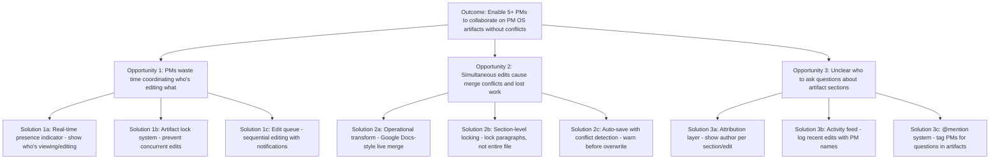

# Opportunity Solution Tree: Real-Time Collaboration Indicator

**Created**: 2026-02-01
**Status**: Active - End-to-End Workflow Test
**Related PRD**: execution/prds/2026-02-01_PRD_Real-Time-Collaboration-Indicator_v0.1.md (to be created)

---

## Context

**Strategic Objective**: Improve collaborative product development workflows in PM OS by providing visibility into who is actively working on which artifacts.

**Strategic Alignment**:
- **NSM: Time-to-Spec** (80% reduction target): Reduce coordination overhead and edit conflicts when multiple PMs work on same artifacts
- **NSM: Zero-Clarification Sprint Readiness** (>95% target): Prevent conflicting edits that introduce ambiguity
- **NSM: Identity Traceability** (100% target): Track which PM contributed which sections for attribution

**Problem Space**: Currently, PM OS operates as a single-user system (one PM editing at a time). As teams scale (Phase 6: multi-user), PMs may unknowingly edit the same PRD simultaneously, leading to lost work, merge conflicts, and coordination delays. Need real-time awareness of who is editing what artifact.

**Evidence**:
- Phase 1 validation: Single-user workflow validated successfully
- Phase 6 requirement: Multi-user Git workflow with CODEOWNERS (5+ PMs concurrently)
- Industry baseline: Google Docs shows real-time cursors, Notion shows presence indicators - proven pattern for collaborative editing

---

## OST Diagram

---

## Opportunity Details

### Opportunity 1: PMs waste time coordinating who's editing what artifacts

**Pain Point Description**:
When multiple PMs work on PM OS concurrently, they must manually coordinate via Slack ("Hey, are you editing the Auth PRD?") to avoid conflicts. This adds 5-10 minutes per editing session and breaks flow state.

**Evidence**:
- **Industry pattern**: Collaborative tools (Google Docs, Figma, Notion) all solved this with presence indicators
- **PM OS Phase 6 target**: 5+ PMs using system concurrently - coordination overhead grows exponentially (n²)
- **Current state**: Single-user workflow - no coordination needed yet, but will become bottleneck at scale

**User Impact**:
- **Frequency**: Every time PM wants to edit artifact (10-20x per day per PM at scale)
- **Severity**: Moderate - delays start of work, breaks concentration
- **Affected Users**: All PMs in multi-user environment (Phase 6+)

**Potential Solutions**:

**Solution 1a: Real-time Presence Indicator** (Recommended)
- Show avatar/name of PMs currently viewing or editing each artifact
- Update in real-time (WebSocket or polling every 5 seconds)
- Display at top of artifact file or in file browser
- **Pros**: Low friction, non-blocking, proven pattern (Google Docs, Notion)
- **Cons**: Requires server component (Phase 6 web app), doesn't prevent conflicts

**Solution 1b: Artifact Lock System**
- First PM to open artifact gets exclusive edit lock
- Other PMs see "Locked by [PM Name]" and must wait or request handoff
- **Pros**: Prevents conflicts completely, simple to implement
- **Cons**: Blocking workflow, frustrating if PM forgets to unlock

**Solution 1c: Edit Queue**
- PMs request to edit artifact, added to queue
- System notifies when artifact becomes available
- **Pros**: Fair ordering, clear expectations
- **Cons**: Adds delay, complex state management

**Recommendation**: Solution 1a (Real-time presence indicator) - proven pattern, non-blocking, aligns with modern collaborative tools.

---

### Opportunity 2: Simultaneous edits cause merge conflicts and lost work

**Pain Point Description**:
If two PMs edit the same artifact file concurrently and both save (git commit), one PM's changes will overwrite the other's, or require manual merge conflict resolution. This results in lost work (30-60 minutes to recreate) and frustration.

**Evidence**:
- **Git behavior**: Concurrent edits to same file create merge conflicts
- **Industry baseline**: Google Docs solved this with operational transform (live merging)
- **Risk timeline**: Phase 6 (multi-user) - will encounter this immediately without mitigation

**User Impact**:
- **Frequency**: Low initially (1-2x per week per team), increases with team size
- **Severity**: High - lost work is demoralizing, requires recreation time
- **Affected Users**: All PMs in multi-user environment

**Potential Solutions**:

**Solution 2a: Operational Transform** (Google Docs-style live merge)
- Real-time conflict resolution at character level
- Both PMs see each other's edits live
- **Pros**: Gold standard for collaboration, zero lost work
- **Cons**: Very complex to implement (CRDTs, WebSockets), requires web app

**Solution 2b: Section-Level Locking**
- Lock individual sections (# headings) instead of entire file
- Two PMs can edit different sections simultaneously
- **Pros**: Balance between collaboration and conflict prevention
- **Cons**: Still blocking within sections, requires parsing Markdown structure

**Solution 2c: Auto-save with Conflict Detection** (Recommended for Phase 2)
- Before saving (git commit), check if file changed since last read
- If conflict detected, show diff and prompt PM to merge manually
- **Pros**: Prevents silent overwrites, simpler than operational transform
- **Cons**: Interrupts workflow, PM must manually resolve

**Recommendation**: Solution 2c (Auto-save with conflict detection) for Phase 2 (IDE-based), migrate to Solution 2a (Operational transform) in Phase 6 (web app).

---

### Opportunity 3: Unclear who to ask questions about artifact sections

**Pain Point Description**:
When reviewing a PRD, PM may have questions about specific sections (e.g., "Why did we choose this metric?"). Without attribution, unclear who wrote that section, leading to broadcast questions in Slack and delayed answers.

**Evidence**:
- **Current state**: Git commits show author, but at file level, not section level
- **Industry pattern**: Google Docs "Suggesting" mode shows per-edit attribution, Notion shows page authors
- **PM OS Phase 3**: Self-improvement loop requires tracking which agent generated which content

**User Impact**:
- **Frequency**: Moderate (3-5x per week per PM during reviews)
- **Severity**: Low-moderate - slows down reviews, increases communication overhead
- **Affected Users**: All PMs reviewing artifacts, especially during onboarding

**Potential Solutions**:

**Solution 3a: Attribution Layer**
- Track author (PM name or agent name) per section/paragraph
- Display as metadata or hover tooltip
- **Pros**: Fine-grained attribution, useful for reviews and self-improvement
- **Cons**: Requires tracking infrastructure, may clutter UI

**Solution 3b: Activity Feed** (Recommended)
- Log recent edits with timestamps and PM names
- Show in sidebar or separate activity file
- **Pros**: Simple to implement (git log), non-intrusive
- **Cons**: Not section-specific, requires reading full log

**Solution 3c: @mention System**
- Allow PMs to @mention other PMs in artifact comments
- Notify mentioned PM via Slack/email
- **Pros**: Direct communication, proven pattern (GitHub, Notion)
- **Cons**: Requires comment infrastructure, separate from attribution

**Recommendation**: Solution 3b (Activity feed) for Phase 2 (leverage git log), add Solution 3a (Attribution layer) in Phase 6 (web app with richer metadata).

---

## Solution Evaluation

### Prioritization Framework

**Evaluation Criteria**:
1. **NSM Impact**: Does solution advance Time-to-Spec or Zero-Clarification Sprint Readiness?
2. **Implementation Complexity**: Can we deliver in Phase 2 (IDE-based) or requires Phase 6 (web app)?
3. **User Friction**: Does solution block or enable workflow?
4. **Proven Pattern**: Do industry leaders use this approach?

### Recommended Solution Set

**Phase 2 (IDE-Based, Current)**:
1. ✅ **Conflict Detection** (Opp 2, Solution 2c): Auto-save with conflict detection before git commit
2. ✅ **Activity Feed** (Opp 3, Solution 3b): Display git log as activity feed
3. ⚠️ **Coordination via Slack** (Opp 1, Manual): Keep manual Slack coordination for Phase 2 (low team size)

**Phase 6 (Web App, Future)**:
1. ✅ **Real-time Presence** (Opp 1, Solution 1a): Show who's viewing/editing
2. ✅ **Operational Transform** (Opp 2, Solution 2a): Google Docs-style live collaboration
3. ✅ **Attribution Layer** (Opp 3, Solution 3a): Section-level authorship tracking

**Rationale**: Phase 2 focuses on "preventing disasters" (conflict detection) using IDE capabilities (git). Phase 6 enables "true collaboration" (real-time presence, operational transform) requiring web infrastructure.

---

## Next Steps

### Immediate Actions
- [ ] Generate PRD v0.1 for "Conflict Detection Before Save" feature (Phase 2 priority)
- [ ] Engineering Partner: Assess technical feasibility (git hooks, pre-commit checks)
- [ ] Data Analyst: Define metrics (conflict prevention rate, time saved)
- [ ] UX Strategist: Design conflict resolution UI (merge dialog)
- [ ] GTM Strategist: Position as "team-ready PM OS" (preparation for multi-user launch)

### Long-Term Roadmap
- **Phase 2** (Current): Conflict detection + activity feed
- **Phase 6** (Weeks 18-24): Real-time presence + operational transform + attribution layer

### Success Metrics (Phase 2 Feature)
- **Conflict Prevention Rate**: > 95% of potential conflicts detected before overwrite
- **Time Saved**: Reduce conflict resolution time from 30-60 min (manual merge) to 5-10 min (assisted merge)
- **User Satisfaction**: > 4.0/5 rating on conflict detection UX from PM team

---

**OST Status**: Complete - Ready for PRD Generation
**Recommended Feature**: Conflict Detection Before Save (Phase 2 priority)
**Strategic Alignment**: ✅ Advances Zero-Clarification Sprint Readiness NSM (prevents ambiguity from conflicting edits)
**Next Step**: Product Architect generates PRD v0.1
