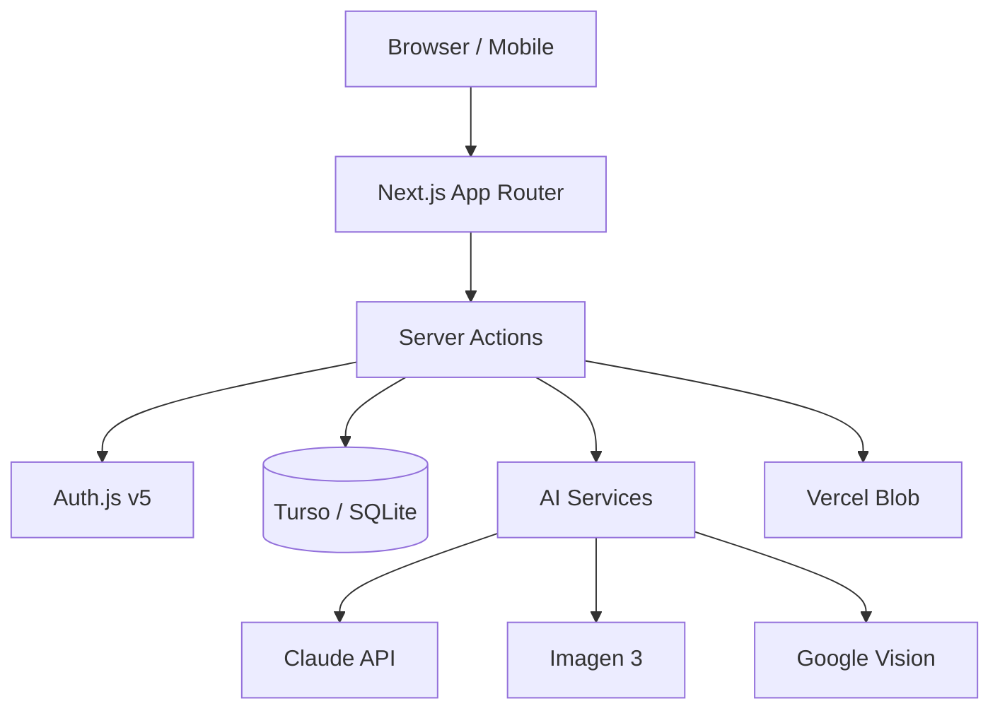

# [PROJECT_NAME]

[ONE_LINE_DESCRIPTION]

**Live**: [LIVE_URL]
**Status**: [STATUS — e.g., In Development / Beta / Production]

---

## Features

### [DOMAIN_1 — e.g., Recipe Management]
- [Feature 1 — e.g., Create, edit, and delete recipes with rich metadata]
- [Feature 2]
- [Feature 3]

### [DOMAIN_2 — e.g., Meal Planning]
- [Feature 1]
- [Feature 2]

### [DOMAIN_3 — e.g., AI-Powered Features]
- [Feature 1]
- [Feature 2]

---

## Tech Stack

| Layer | Technology | Purpose |
|-------|-----------|---------|
| Framework | Next.js 15+ (App Router) | SSR, Server Actions, Vercel-native |
| Language | TypeScript (strict mode) | Type safety end-to-end |
| Styling | Tailwind CSS v4 | Utility-first styling |
| Components | shadcn/ui (Radix primitives) | Accessible, customizable UI |
| Database | Turso (SQLite edge) | Edge-replicated database |
| ORM | Drizzle ORM | Type-safe queries and migrations |
| Auth | Auth.js v5 | [AUTH_PROVIDERS — e.g., Google OAuth] |
| AI | [AI_SERVICES — e.g., Claude API, Imagen 3, Google Vision] | [AI_PURPOSE] |
| State | React Server Components + nuqs | Minimal client state, URL-driven filters |
| Storage | Vercel Blob | CDN-backed file storage |
| Deployment | Vercel | Auto CI/CD, preview deploys |

---

## Architecture



---

## Project Structure

```
src/
├── app/                    # Next.js App Router pages
│   ├── layout.tsx          # Root layout (auth, theme, fonts)
│   ├── (auth)/             # Login / register routes
│   └── (app)/              # Authenticated routes
│       ├── [ROUTE_1]/      # [DESCRIPTION]
│       └── [ROUTE_2]/      # [DESCRIPTION]
├── components/
│   ├── ui/                 # shadcn/ui (auto-generated — do not modify)
│   ├── shared/             # Cross-feature compositions
│   └── [feature]/          # Feature-specific components
├── db/
│   ├── schema.ts           # Drizzle schema ([TABLE_COUNT] tables)
│   ├── index.ts            # Turso connection
│   └── queries/            # Reusable query functions
├── actions/                # Server Actions (mutations)
├── lib/
│   ├── auth.ts             # Auth.js configuration
│   ├── utils.ts            # cn() + shared utilities
│   └── validators.ts       # Zod schemas for all inputs
├── test/
│   └── setup.ts            # Vitest setup (RTL cleanup, mocks)
└── types/                  # Shared TypeScript types
```

---

## Getting Started

### Prerequisites

- Node.js 22+
- pnpm 9+
- [Turso CLI](https://docs.turso.tech/cli/installation) (for database)

### Setup

```bash
# Clone
git clone [REPO_URL]
cd [PROJECT_NAME]

# Install dependencies
pnpm install

# Environment setup
cp .env.example .env.local
# Fill in values — see Environment Variables section below

# Database setup
pnpm db:push

# Start development server
pnpm dev
```

---

## Environment Variables

| Variable | Description | Source | Required |
|----------|------------|--------|----------|
| `TURSO_DATABASE_URL` | Turso database connection | [Turso Dashboard](https://turso.tech) | Yes |
| `TURSO_AUTH_TOKEN` | Turso auth token | Turso Dashboard | Yes |
| `AUTH_SECRET` | Auth.js session encryption | `openssl rand -base64 32` | Yes |
| `AUTH_URL` | Auth callback URL | `http://localhost:3000` (dev) | Yes |
| `GOOGLE_CLIENT_ID` | Google OAuth client ID | [Google Cloud Console](https://console.cloud.google.com) | Yes |
| `GOOGLE_CLIENT_SECRET` | Google OAuth secret | Google Cloud Console | Yes |
| `ANTHROPIC_API_KEY` | Claude API key | [Anthropic Console](https://console.anthropic.com) | [Yes/No] |
| [ADDITIONAL_VARS] | [DESCRIPTION] | [SOURCE] | [Yes/No] |

---

## Scripts Reference

```bash
pnpm dev              # Start dev server (http://localhost:3000)
pnpm build            # Production build
pnpm start            # Start production server
pnpm test             # Run unit + component tests with coverage
pnpm test:watch       # Run tests in watch mode
pnpm test:e2e         # Run Playwright E2E tests
pnpm db:push          # Push Drizzle schema to Turso
pnpm db:generate      # Generate migration files
pnpm db:studio        # Open Drizzle Studio (DB browser)
pnpm biome check .    # Lint + format check
pnpm biome check . --fix  # Auto-fix lint + format
```

---

## Testing

### Run Tests

```bash
pnpm test             # Unit + component tests with coverage
pnpm test:watch       # Watch mode for TDD
pnpm test:e2e         # Playwright E2E (starts dev server automatically)
```

### Writing Tests

- **Server Actions**: `src/actions/__tests__/[action].test.ts` — mock db + auth, test Zod validation + business logic
- **Components**: `src/components/[feature]/__tests__/[component].test.tsx` — RTL render, user events, assertions
- **E2E**: `e2e/[flow].spec.ts` — Playwright, critical user journeys
- **Test patterns**: see PM OS `templates/testing/` for starter examples

### Coverage Targets

- `lib/` and `db/queries/`: 80% lines and functions
- `actions/`: 70% lines and functions

---

## Deployment

### Vercel Setup

1. Connect GitHub repo to Vercel
2. Set environment variables in Vercel dashboard
3. Deploy: merge to `main` triggers production deploy
4. Every PR gets a preview deploy URL for QA

### CI Pipeline

GitHub Actions runs on every push and PR:
1. Type check (`tsc --noEmit`)
2. Lint + format (`biome check .`)
3. Unit + component tests (`vitest --coverage`)
4. Security audit (`pnpm audit`)
5. E2E tests (on preview URL, when enabled)

---

## Data Model

### Key Tables

| Table | Purpose | Key Fields |
|-------|---------|-----------|
| [TABLE_1] | [PURPOSE] | [FIELDS] |
| [TABLE_2] | [PURPOSE] | [FIELDS] |
| [TABLE_3] | [PURPOSE] | [FIELDS] |

### Relationships

```mermaid
erDiagram
    [TABLE_1] ||--o{ [TABLE_2] : has
    [TABLE_2] }o--|| [TABLE_3] : belongs_to
```

---

## AI Integration

| Service | What It Does | Estimated Cost |
|---------|-------------|---------------|
| [SERVICE_1 — e.g., Claude Haiku 4.5] | [PURPOSE — e.g., Recipe text parsing] | [COST — e.g., ~$0.001/call] |
| [SERVICE_2] | [PURPOSE] | [COST] |

All AI calls are server-side only (Server Actions). See `identity/STANDARDS.md` AI Services Inventory for full details.

---

## Contributing

### Branch Naming

`feature/[JIRA-KEY]-[brief-description]` (e.g., `feature/PROJ-1-recipe-crud`)

### Commit Convention

Conventional Commits: `feat|fix|refactor|test|docs|chore|ci(scope): description`

### PR Checklist

- [ ] `pnpm tsc --noEmit` — no type errors
- [ ] `pnpm biome check .` — lint + format clean
- [ ] `pnpm test` — all tests pass
- [ ] No new `any` types without justification
- [ ] Zod validators for all new inputs
- [ ] Interactive elements keyboard-navigable
- [ ] README updated if features changed

---

**PM OS Specs**: `execution/[EXECUTION_FOLDER]/` in the PM OS repo
**Engineering Standards**: `identity/STANDARDS.md` in the PM OS repo
